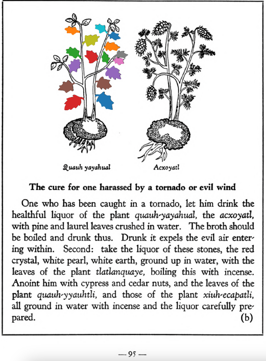

Variants: quauh-yayahual  

## Subchapter 9g  
**For ringworm and tetter.** For one laboring with this scaly disease, let there be ground together and set over coals the bark of the cherry, of the incense bearing[quauh-xiyotl](Quauh-xiyotl.md) tree, the apple, the flowers of the [topozan](Topozan.md) and [cacalo-xochitl](Cacalo-xochitl.md), oak roots, cypress nuts, leaves of the plants[tlatlanquaye](Tlatlanquaye.md), [quauh-yayahual](Quauh-yayahual.md), the herbs [tepe-chian](Tepe-chian.md), [coyo-xihuitl](Coyo-xihuitl.md), [a-quahuitl](A-quahuitl.md), cedar nuts and leaves; with these when heated let him bathe himself, and the affected part be rubbed with the burned pine, with which, and all the above, let him be rubbed.  
[https://archive.org/details/aztec-herbal-of-1552/page/81](https://archive.org/details/aztec-herbal-of-1552/page/81)  

## Subchapter 10b  
**The cure for one harassed by a tornado or evil wind.** One who has been caught in a tornado, let him drink the healthful liquor of the plant [quauh-yayahual](Quauh-yayahual.md), the [acxoyatl](Acxoyatl.md), with pine and laurel leaves crushed in water. The broth should be boiled and drunk thus. Drunk it expels the evil air entering within. Second; take the liquor of these stones, the red crystal, white pearl, white earth, ground up in water, with the leaves of the plant tlatlanquaye, boiling this with incense. Anoint him with cypress and cedar nuts, and the leaves of the plant [qauh-yyauhtli](Quauh-yyauhtli.md), and those of the plant [xiuh-ecapatli](Eca-patli.md), all ground in water with incense and the liquor carefully prepared.  
[https://archive.org/details/aztec-herbal-of-1552/page/95](https://archive.org/details/aztec-herbal-of-1552/page/95)  

  
Leaf traces by: Zoë Migicovsky, Acadia University, Canada  
