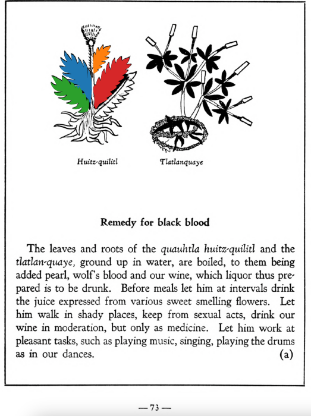

Variants: quauhtla huitz-quilitl  

## Subchapter 7m  
**Abdominal chill.** This is removed by taking a drink made of the roots of the plants [copaliyac-xiuhtontli](Copaliyac-xiuhtontli.md), [tlanexti-xiuhtontli](Tlanextia_xiuhtontli.md), [chichic-xihuitl](Chichic-xihuitl.md)and the [quauhtla huitz-quilitl](Quauhtla_huitz-quilitl.md), with added Indian wine.  
[https://archive.org/details/aztec-herbal-of-1552/page/55](https://archive.org/details/aztec-herbal-of-1552/page/55)  

## Subchapter 9a  
**Remedy for black blood.** The leaves and roots of the [quauhtla huitz-quilitl](Quauhtla_huitz-quilitl.md) and the[tlatlan-quaye](Tlatlanquaye.md), ground up in water, are boiled, to them being added pearl, wolf’s blood and our wine, which liquor thus prepared is to be drunk. Before meals let him at intervals drink the juice expressed from various sweet smelling flowers. Let him walk in shady places, keep from sexual acts, drink our wine in moderation, but only as medicine. Let him work at pleasant tasks, such as playing music, singing, playing the drums as in our dances.  
[https://archive.org/details/aztec-herbal-of-1552/page/73](https://archive.org/details/aztec-herbal-of-1552/page/73)  

  
Leaf traces by: Kylie DeViller, Acadia University, Canada  
