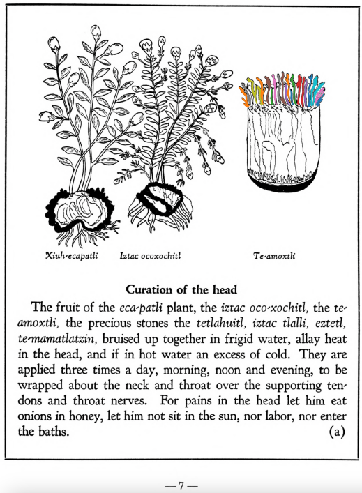
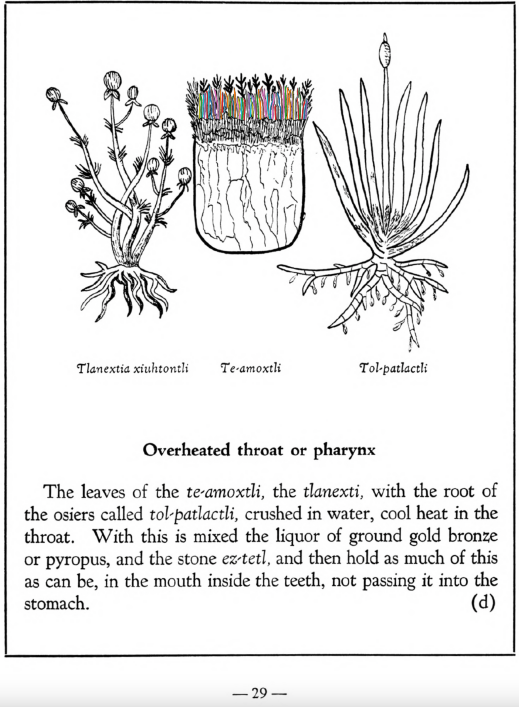

Variants: te-amoxtli  

## Subchapter 1a  
**Curation of the head.** The fruit of the [eca-patli](Eca-patli.md) plant, the [iztac oco-xochitl](Iztac_oco-xochitl.md), the [te-amoxtli](Te-amoxtli.md), the precious stones the [tetlahuitl](tetlahuitl_v2.md), [iztac tlalli](iztac_tlalli.md), [eztetl](eztetl.md), [te-mamatlatzin](te-mamatlatzin.md), bruised up together in frigid water, allay heat in the head, and if in hot water an excess of cold. They are applied three times a day, morning, noon and evening, to be wrapped about the neck and throat over the supporting tendons and throat nerves. For pains in the head let him eat onions in honey, let him not sit in the sun, nor labor, nor enter the baths.  
[https://archive.org/details/aztec-herbal-of-1552/page/7](https://archive.org/details/aztec-herbal-of-1552/page/7)  

## Subchapter 5d  
**Overheated throat or pharynx.** The leaves of the [te-amoxtli](Te-amoxtli.md), the [tlanexti](Tlanextia_xiuhtontli.md), with the root ofthe osiers called [tol-patlactli](Tol-patlactli.md), crushed in water, cool heat in the throat. With this is mixed the liquor of ground gold bronze or pyropus, and the stone [ez-tetl](eztetl.md), and then hold as much of this as can be, in the mouth inside the teeth, not passing it into the stomach.  
[https://archive.org/details/aztec-herbal-of-1552/page/29](https://archive.org/details/aztec-herbal-of-1552/page/29)  

## Subchapter 5e  
**Suppuration of roof of mouth and throat.** Suppuration of the roof of the mouth and throat is cured by the root of the [xal-tomatl](Xal-tomatl.md), crushed together with the [te-amoxtli](Te-amoxtli.md), white earth, small or sharp variegated stones that are gathered from a torrent, [a-camallo-tetl](a-camallo-tetl_v2.md), with Indian spikes poorly ground, the flowers of the [huacal-xochitl](Huacal-xochitl.md) and [tlaco-izqui-xochitl](Tlaco-izqui-xochitl.md), of which the juice is well squeezed and promptly poured into the throat.  
[https://archive.org/details/aztec-herbal-of-1552/page/30](https://archive.org/details/aztec-herbal-of-1552/page/30)  

## Subchapter 8b  
**The argemon or groin plant.** The plants xiuhtontli tlanen-popoloua and those that grow in a garden once burned over, the fruit [te-tzapotl](Te-tzapotl.md), brambles, [te-amoxtli](Te-amoxtli.md), the stone found in a swallow’s stomach, ground in swallow’s and mouse’s blood, and applied, allay pains of the groin and reduce swellings.  
[https://archive.org/details/aztec-herbal-of-1552/page/58](https://archive.org/details/aztec-herbal-of-1552/page/58)  

## Subchapter 8g  
**Pain in the knees.** When the knees pain one, anoint them with the liquor of the plants [coyo-xihuitl](Coyo-xihuitl.md), [tepe-chian](Tepe-chian.md), [xoxouhca-patli](xoxouhca-patli.md) macerated with the [te-amoxtli](Te-amoxtli.md) in swallow's blood.  
[https://archive.org/details/aztec-herbal-of-1552/page/63](https://archive.org/details/aztec-herbal-of-1552/page/63)  

## Subchapter 9f  
**Remedy for lesions of the body.** Lesions caused by rough treatment should be treated with a poultice made from [tlazo-teo-zacatl](Tlazol-teo-zacatl.md), [centzon-xochitl](Centzon-xochitl.md), [xiuh-tontli](Xiuhtontli.md), [a-xocotl](A-xocotl.md), [tlayapaloni](Tla-yapaloni.md), [xiuhtontli](Xiuhtontli.md), moss from some tree, cypress nuts, seeds of the nettle, and the tree [ayauh-quahuitl](Ayauh-quahuitl.md). Let the ill-treated one drink a broth carefully prepared from the root of the [coanenepilli](Coanenepilli.md), tlanextia xihuitl, [chicom-catl](Chicom-acatl.md), the flower of the [a-xocotl](A-xocotl.md) and [izqui-xochitl](Izqui-xochitl.md), [tetlahuital](tetlahuitl_v2.md), [eztetl](eztetl.md), [te-amoxtli](Te-amoxtli.md), the blood of an aquatic bird, the [huexo-canauhtli](huexo-canauhtli.md), and some [tlatlanquaye](Tlatlanquaye.md) leaves, all of which are to be ground up in acidulous water.  
[https://archive.org/details/aztec-herbal-of-1552/page/80](https://archive.org/details/aztec-herbal-of-1552/page/80)  

## Subchapter 9p  
**Inflammations.** An inflamed part of the body will be relieved by a liquor from the [nohpalli](Nopalli.md), [te-amoxtli](Te-amoxtli.md), [tetzmitl](Tetzmitl.md), [eca-patli](Eca-patli.md), [te-xiyotl](Te-xiyotl.md) and [huitz-quilitl](Huitz-quilitl.md), anointing the part thoroughly and rubbing it with honey and yolk of egg.  
[https://archive.org/details/aztec-herbal-of-1552/page/90](https://archive.org/details/aztec-herbal-of-1552/page/90)  

## Subchapter 9q  
**Those struck by lightning.** Let one struck by a thunderbolt drink a potion well prepared from leaves of trees, namely the [ayauh-quahuitl](Ayauh-quahuitl.md), [tepaquilti quahuitl](tepaquilti_quahuitl.md), very green cypress, the bush [iztauh-yatl](Iztauyattl.md), the herbs[quauh-yyauhtli](Quauh-yyauhtli.md) and [te-amoxtli](Te-amoxtli.md). But however the drink is to be given, let it be heated.  Let the body also be anointed with a plaster made of the herbs [papalo-quilitl](Papalo-quilitl.md), [tlal-ecapatli](Tlal-ecapatli.md), [quauh-yyauhtli](Quauh-yyauhtli.md), [tlatlanquaye](Tlatlanquaye.md), huitbitzil xochitil, [iztac-oco-xochitl](Iztac_oco-xochitl.md), and in addition all the plants upon which the lightning struck. A few days later lethim drink water into which white frankincense is thrown. The water is boiled with white and whitish incense, with the burned bones of a fox added. Also mix some Indian wine with the above. Afterwards you will instill into the nostrils a medicine made of white pearl, the root [tlatlacotic](Tlatlacotic.md), and all plants growing in a garden that has been burned over. Let also be suffumigated by white incense thrown upon the coals, the wax ointment we call [xochi-oco-tzotl](xochi-ocotzotl.md), and the good odor of the herb [quauh-yyauhtli](Quauh-yyauhtli.md).  
[https://archive.org/details/aztec-herbal-of-1552/page/91](https://archive.org/details/aztec-herbal-of-1552/page/91)  

## Subchapter 12b  
**When an infant because of some pain refuses the breast.** When the infant is so affected that it spews out the milk and will not take the breast into his mouth, give him a drink made of the herb called called [te-amoxtli](Te-amoxtli.md), quail’s blood set in the sun, and its hairs somewhat restored, which you will incinerate. Let him have a poultice carefully prepared from a weasel’s brain and a scorched human bone, drawing out the acid water.  
[https://archive.org/details/aztec-herbal-of-1552/page/114](https://archive.org/details/aztec-herbal-of-1552/page/114)  

  
Leaf traces by: Dan Chitwood, Michigan State University, USA  
  
Leaf traces by: Dan Chitwood, Michigan State University, USA  
