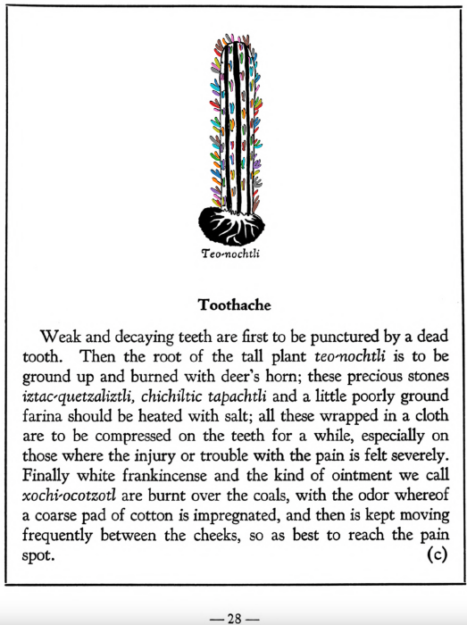

Variants: teo-nochtli  

## Subchapter 5c  
**Toothache.** Weak and decaying teeth are first to be punctured by a dead tooth. Then the root of the tall plant [teo-nochtli](Teo-nochtli.md) is to be ground up and burned with deer’s horn; these precious stones [iztac-quetzaliztli](iztac-quetzaliztli.md), [chichiltic tapachtli](chichiltic_tapachtli.md) and a little poorly ground farina should be heated with salt; all these wrapped in a cloth are to be compressed on the teeth for a while, especially on those where the injury or trouble with the pain is felt severely. Finally white frankincense and the kind of ointment we call [xochi-ocotzotl](xochi-ocotzotl.md) are burnt over the coals, with the odor whereof a coarse pad of cotton is impregnated, and then is kept moving frequently between the cheeks, so as best to reach the pain spot.  
[https://archive.org/details/aztec-herbal-of-1552/page/28](https://archive.org/details/aztec-herbal-of-1552/page/28)  

  
Leaf traces by: Dan Chitwood, Michigan State University, USA  
