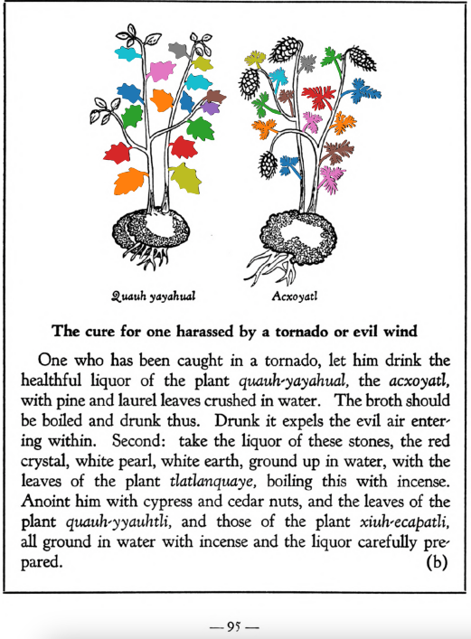

**The cure for one harassed by a tornado or evil wind.** One who has been caught in a tornado, let him drink the healthful liquor of the plant [quauh-yayahual](Quauh-yayahual.md), the [acxoyatl](Acxoyatl.md), with pine and laurel leaves crushed in water. The broth should be boiled and drunk thus. Drunk it expels the evil air entering within. Second; take the liquor of these stones, the red crystal, white pearl, white earth, ground up in water, with the leaves of the plant tlatlanquaye, boiling this with incense. Anoint him with cypress and cedar nuts, and the leaves of the plant [qauh-yyauhtli](Quauh-yyauhtli.md), and those of the plant [xiuh-ecapatli](Eca-patli.md), all ground in water with incense and the liquor carefully prepared.  
[https://archive.org/details/aztec-herbal-of-1552/page/95](https://archive.org/details/aztec-herbal-of-1552/page/95)  

  
Leaf traces by: Zoë Migicovsky, Acadia University, Canada  