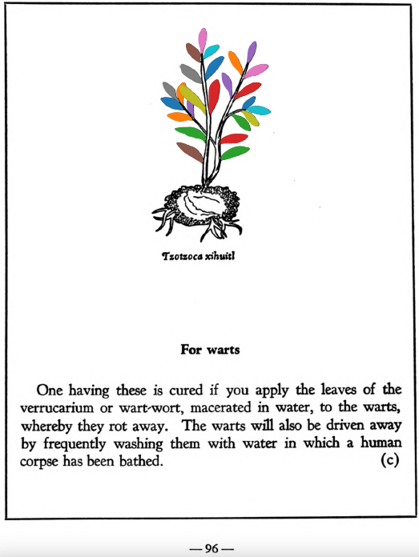

=== "English :flag_us:"
    **For warts.** One having these is cured if you apply the leaves of the verrucarium or wart-wort, macerated in water, to the warts, whereby they rot away. The warts will also be driven away by frequently washing them with water in which a human corpse has been bathed.  
    [https://archive.org/details/aztec-herbal-of-1552/page/96](https://archive.org/details/aztec-herbal-of-1552/page/96)  

=== "Español :flag_mx:"
    **Para verrugas.** Quien tenga estas se cura si se le aplican hojas del verrucarium o hierba de las verrugas, maceradas en agua, sobre las verrugas, con lo cual se pudren. También se eliminan las verrugas lavándolas frecuentemente con agua en la que ha sido bañado un cadáver humano.  

  
Leaf traces by: Zoë Migicovsky, Acadia University, Canada  