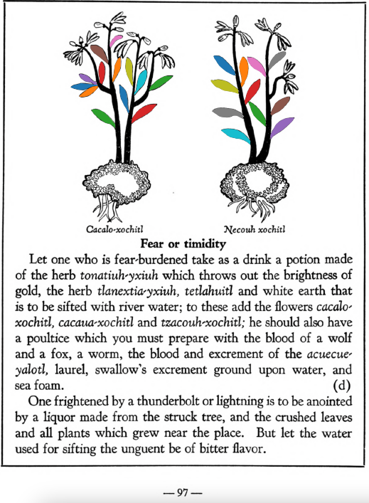

=== "English :flag_us:"
    **Fear or timidity.** Let one who is fear-burdened take as a drink a potion made of the herb [tonatiuh-yxiuh](Tonatiuh yxiuh v1.md) which throws out the brightness of gold, the herb [tlanexti-yxiuh](Tlanextia-yxiuh.md), tetlahuitl and white earth that is to be sifted with river water; to these add the flowers [cacalo-xochitl](Cacalo-xochitl.md), [cacaua-xochitl](Cacaua-xochitl.md) and [tzacouh-xochitl](Tzacouh-xochitl.md); he should also have a poultice which you must prepare with the blood of a wolf and a fox, a worm, the blood and excrement of the acuecue-yalotl, laurel, swallow’s excrement ground upon water, and sea foam. One frightened by a thunderbolt or lightning is to be anointed by a liquor made from the struck tree, and the crushed leaves and all plants which grew near the place. But let the water used for sifting the unguent be of bitter flavor.  
    [https://archive.org/details/aztec-herbal-of-1552/page/97](https://archive.org/details/aztec-herbal-of-1552/page/97)  

=== "Español :flag_mx:"
    **Miedo o timidez.** Quien esté cargado de miedo debe beber una poción hecha con la hierba [tonatiuh-yxiuh](Tonatiuh yxiuh v1.md), que irradia el brillo del oro, la hierba [tlanexti-yxiuh](Tlanextia-yxiuh.md), tetlahuitl y tierra blanca que se ha de cernir con agua de río; a esto se le agregan las flores [cacalo-xochitl](Cacalo-xochitl.md), [cacaua-xochitl](Cacaua-xochitl.md) y [tzacouh-xochitl](Tzacouh-xochitl.md); también debe tener un emplasto que se prepara con sangre de lobo y de zorro, un gusano, la sangre y el excremento del acuecue-yalotl, laurel, excremento de golondrina molido en agua y espuma de mar. Quien haya sido asustado por un rayo debe ser untado con un licor hecho del árbol golpeado, y con las hojas trituradas y todas las plantas que hayan crecido cerca del lugar. Pero el agua usada para cernir el ungüento debe tener sabor amargo.  

  
Leaf traces by: Zoë Migicovsky, Acadia University, Canada  