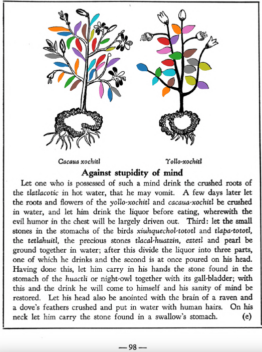

=== "English :flag_us:"
    **Against stupidity of mind.** Let one who is possessed of such a mind drink the crushed roots of the [tlatlacotic](Tlatlacotic.md) in hot water, that he may vomit. A few days later let the roots and flowers of the [yollo-xochitl](Yollo-xochitl.md) and [cacaua-xochitl](Cacaua-xochitl.md) be crushed in water, and let him drink the liquor before eating, wherewith the evil humor in the chest will be largely driven out. Third: let the small stones in the stomachs of the birds [xiuhquechol-tototl](xiuh-quechol-tototl.md) and [tlapa-tototl](tlapal-tototl.md), the [tetlahuitl](tetlahuitl v2.md), the precious stones [tlacal-huatzin](tlacal-huatzin.md), [eztetl](eztetl.md) and pearl be ground together in water; after this divide the liquor into three parts, one of which he drinks and the second is at once poured on his head. Having done this, let him carry in his hands the stone found in the stomach of the [huactli](huactli.md) or night-owl together with its gall-bladder; with this and the drink he will come to himself and his sanity of mind be restored. Let his head also be anointed with the brain of a raven and a dove’s feathers crushed and put in water with human hairs. On his neck let him carry the stone found in a swallow’s stomach.  
    [https://archive.org/details/aztec-herbal-of-1552/page/98](https://archive.org/details/aztec-herbal-of-1552/page/98)  

=== "Español :flag_mx:"
    **Contra la torpeza de entendimiento.** Quien tenga esta condición debe beber las raíces machacadas del [tlatlacotic](Tlatlacotic.md) en agua caliente, para que vomite. Unos días después, que se trituren las raíces y flores del [yollo-xochitl](Yollo-xochitl.md) y [cacaua-xochitl](Cacaua-xochitl.md) en agua, y que beba el licor antes de comer, con lo cual se expulsará en gran parte el humor maligno del pecho. En tercer lugar: que se muelan en agua las piedrecillas del estómago de las aves [xiuhquechol-tototl](xiuh-quechol-tototl.md) y [tlapa-tototl](tlapal-tototl.md), el [tetlahuitl](tetlahuitl v2.md), las piedras preciosas [tlacal-huatzin](tlacal-huatzin.md), [eztetl](eztetl.md) y perla; después de esto se divide el licor en tres partes: una se bebe, la segunda se vierte de inmediato sobre su cabeza. Habiendo hecho esto, debe llevar en las manos la piedra hallada en el estómago del [huactli](huactli.md) o tecolote junto con su vesícula biliar; con esto y la bebida recobrará el juicio y se restaurará su cordura. También debe untarse la cabeza con el cerebro de un cuervo y plumas de paloma molidas y puestas en agua con cabellos humanos. En su cuello debe llevar la piedra hallada en el estómago de una golondrina.  

  
Leaf traces by: Zoë Migicovsky, Acadia University, Canada  