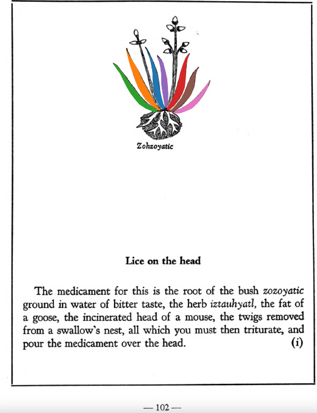

**Lice on the head.** The medicament for this is the root of the bush [zozoyatic](Zozoyatic.md)ground in water of bitter taste, the herb [iztauhyatl](Iztauyattl.md), the fat of a goose, the incinerated head of a mouse, the twigs removed from a swallow’s nest, all which you must then triturate, and pour the medicament over the head.  
[https://archive.org/details/aztec-herbal-of-1552/page/102](https://archive.org/details/aztec-herbal-of-1552/page/102)  

  
Leaf traces by: Alejandra Rougon, UNAM ENES León, México  