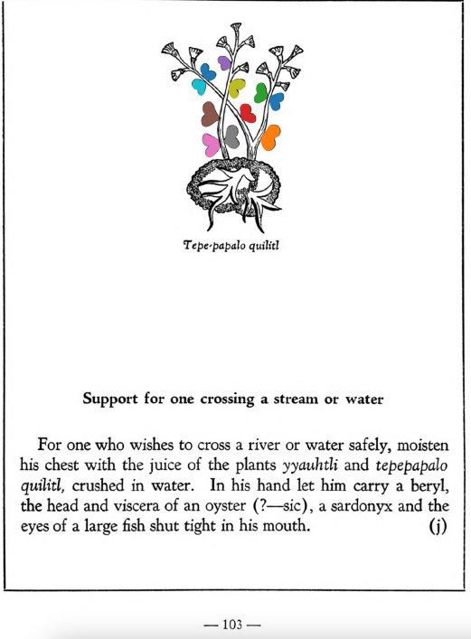

=== "English :flag_us:"
    **Support for one crossing a stream or water.** For one who wishes to cross a river or water safely, moisten his chest with the juice of the plants [yyauhtli](Quauh-yyauhtli.md) and tepepapalo quilitl, crushed in water. In his hand let him carry a beryl, the head and viscera of an oyster, a sardonyx and the eyes of a large fish shut tight in his mouth.  
    [https://archive.org/details/aztec-herbal-of-1552/page/103](https://archive.org/details/aztec-herbal-of-1552/page/103)  

=== "Español :flag_mx:"
    **Amuleto para cruzar un arroyo o agua.** Para quien desee cruzar un río o agua con seguridad, que se le unte el pecho con el jugo de las plantas [yyauhtli](Quauh-yyauhtli.md) y tepepapalo quilitl, trituradas en agua. En su mano debe llevar un berilo, la cabeza y vísceras de una ostra, una sardónica y los ojos de un pez grande apretados en su boca.  

  
Leaf traces by: Alejandra Rougon-Cardoso, Laboratory of Agrigenomic Sciences, ENES Unidad León, México  