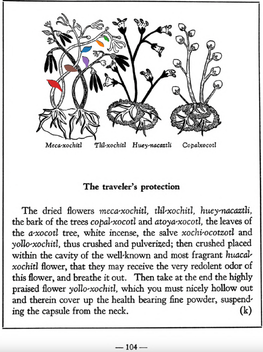

**The traveler’s protection.** The dried flowers [meca-xochitl](Meca-xochitl.md), [tlil-xochitl](Tlil-xochitl.md), [huey-nacaztli](Huey-nacaztli.md), the bark of the trees [copal-xocotl](Copal-xocotl.md) and [atoya-xocotl](Atoya-xocotl.md), the leaves of the [a-xocotl](A-xocotl.md) tree, white incense, the salve [xochi-ocotzotl](xochi-ocotzotl.md) and[yollo-xochitl](Yollo-xochitl.md), thus crushed and pulverized; then crushed placed within the cavity of the well-known and most fragrant [huacal-xochitl](Huacal-xochitl.md) flower, that they may receive the very redolent odor of this flower, and breathe it out. Then take at the end the highly praised flower [yollo-xochitl](Yollo-xochitl.md), which you must nicely hollow out and therein cover up the health bearing fine powder, suspending the capsule from the neck.  
[https://archive.org/details/aztec-herbal-of-1552/page/104](https://archive.org/details/aztec-herbal-of-1552/page/104)  

  
Leaf traces by: Alejandra Rougon, UNAM ENES León, México  