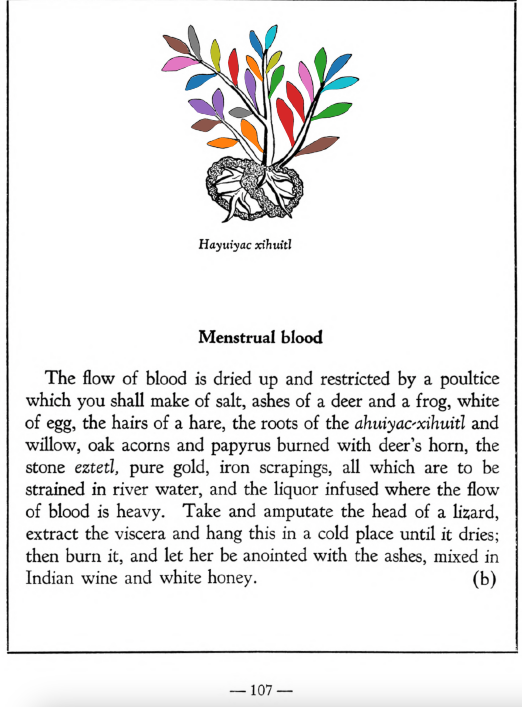

**Menstrual blood.** The flow of blood is dried up and restricted by a poultice which you shall make of salt, ashes of a deer and a frog, white of egg, the hairs of a hare, the roots of the[ahuiyac-xihuitl](Ahuiyac-xihuitl.md) and willow, oak acorns and papyrus burned with deer’s horn, the stone [eztetl](eztetl.md), pure gold, iron scrapings, all which are to be strained in river water, and the liquor infused where the flow of blood is heavy. Take and amputate the head of a lizard, extract the viscera and hang this in a cold place until it dries; then burn it, and let her be anointed with the ashes, mixed in Indian wine and white honey.  
[https://archive.org/details/aztec-herbal-of-1552/page/107](https://archive.org/details/aztec-herbal-of-1552/page/107)  

  
Leaf traces by: Alejandra Rougon, UNAM ENES León, México  