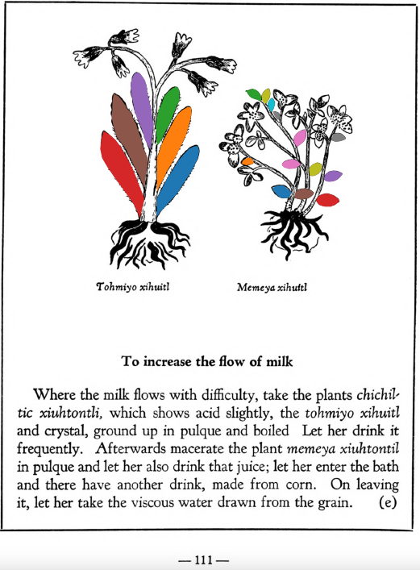

=== "English :flag_us:"
    **To increase the flow of milk.** Where the milk flows with difficulty, take the plants [chichiltic xiuhtontli](Chichiltic xiuhtontli.md), which shows acid slightly, the tohmiyo xihuitland crystal, ground up in pulque and boiled. Let her drink it frequently. Afterwards macerate the plant memeya xiuhtontilin pulque and let her also drink that juice; let her enter the bath and there have another drink, made from corn. On leaving it, let her take the viscous water drawn from the grain.  
    [https://archive.org/details/aztec-herbal-of-1552/page/111](https://archive.org/details/aztec-herbal-of-1552/page/111)  

=== "Español :flag_mx:"
    **Para aumentar el flujo de leche.** Cuando la leche fluye con dificultad, tomar las plantas [chichiltic xiuhtontli](Chichiltic xiuhtontli.md), que muestran acidez leve, el tohmiyo xihuitl y cristal, todo molido en pulque y hervido. Que ella lo beba frecuentemente. Luego, macerar la planta memeya xiuhtontil en pulque y que también beba ese jugo; que entre al baño y allí tome otra bebida, hecha de maíz. Al salir, que tome el agua viscosa extraída del grano.  

  
Leaf traces by: Alejandra Rougon-Cardoso, Laboratory of Agrigenomic Sciences, ENES Unidad León, México  