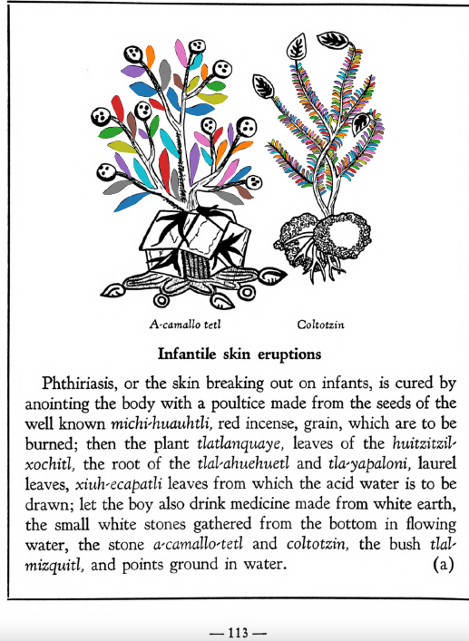

=== "English :flag_us:"
    **Infantile skin eruptions.** Phthiriasis, or the skin breaking out on infants, is cured by anointing the body with a poultice made from the seeds of the well known [michi-huauhtli](Michi-huauhtli.md), red incense, grain, which are to be burned; then the plant [tlatlanquaye](Tlatlanquaye.md), leaves of the [huitzitzil-xochitl](Huitzihtzil-xochitl.md), the root of the [tlal-ahuehuetl](Tlal-ahuehuetl.md) and [tla-yapaloni](Tla-yapaloni.md), laurel leaves, [xiuh-ecapatli](Eca-patli.md) leaves from which the acid water is to be drawn; let the boy also drink medicine made from white earth, the small white stones gathered from the bottom in flowing water, the stone [a-camallo-tetl](a-camallo-tetl v2.md) and [coltotzin](Coltotzin.md), the bush [tlal-mizquitl](Tlal-mizquitl.md), and points ground in water.  
    [https://archive.org/details/aztec-herbal-of-1552/page/113](https://archive.org/details/aztec-herbal-of-1552/page/113)  

=== "Español :flag_mx:"
    **Erupciones cutáneas infantiles.** La ftiriasis, o las erupciones en la piel de los niños, se cura untando el cuerpo con una cataplasma hecha de las semillas del conocido [michi-huauhtli](Michi-huauhtli.md), incienso rojo, grano, que deben quemarse; luego la planta [tlatlanquaye](Tlatlanquaye.md), hojas del [huitzitzil-xochitl](Huitzihtzil-xochitl.md), la raíz del [tlal-ahuehuetl](Tlal-ahuehuetl.md) y [tla-yapaloni](Tla-yapaloni.md), hojas de laurel, hojas de [xiuh-ecapatli](Eca-patli.md) de las cuales se extrae el agua ácida; que el niño también beba medicina hecha de tierra blanca, las pequeñas piedras blancas recogidas del fondo en aguas corrientes, la piedra [a-camallo-tetl](a-camallo-tetl v2.md) y [coltotzin](Coltotzin.md), el arbusto [tlal-mizquitl](Tlal-mizquitl.md), y puntas molidas en agua.  

  
Leaf traces by: Dan Chitwood, Michigan State University, USA  