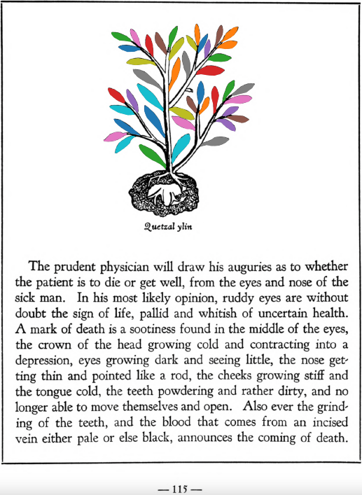

=== "English :flag_us:"
    **Of certain signs of approaching death.** The prudent physician will draw his auguries as to whether the patient is to die or get well, from the eyes and nose of the sick man. In his most likely opinion, ruddy eyes are without doubt the sign of life, palid and whitish of uncertain health. A mark of death is a sootiness found in the middle of the eyes, the crown of the head growing cold and contracting into a depression, eyes growing dark and seeing little, the nose getting thin and pointed like a rod, the cheeks growing stiff and the tongue cold, the teeth powdering and rather dirty, and no longer able to move themselves and open. Also ever the grinding of the teeth, and the blood that comes from an incised vein either pale or else black, announces the coming of death. Also the growing pale, or blackening, and putting on one or another visage, and finally the babbling of words without meaning or order, in the way of parrots. A special prognostic in a woman is observed, namely if the buttocks, calves and sides are as if punctured with some very sharp thorn. In spite of this desperate state, it is still possible to instill into the dying man’s eyes a medicine made of the precious stones [tlacal-huatzin](tlacal-huatzin.md), [eztetl](eztetl.md), pearl and white pearl, with white earth ground together in water. You may anoint the chest with pine wood crushed in water, laurel and the plant [tonatiuh yxiuh](Tonatiuh yxiuh v1.md), which you gather in the summer and keep for the occasion. Also puncture with a sharpened wolf’s bone, or an eagle’s bone, or that of a lion that is either white or spotted black in color, differently marked or sprinkled; to the nostrils you will hang the heart of an eagle covered or wrapped in deerskin. At the extreme point, give a drink made of the precious stones the white pearl, the very green pearl, greenstone, whitish earth, the moss from woodland rocks, and [tlacal-huatzin](tlacal-huatzin.md), which you grind up. Also from cypress nuts, which glow redly. Then the tree [quetzal-ylin](Quetzal-ylin.md), the stones from the stomachs of the swift eagle, the quail, swallow, cock, diver-bird, [quechol-tototl](xiuh-quechol-tototl.md), [tlapal-tototl](tlapal-tototl.md), [noch-tototl](noch-tototl.md), [huitla-tototl](huitlalotl.md) and pigeon, which you shall grind up together. Then indeed when the fatal necessity is at hand, and we are at change of death, the blood pours over the heart in a flood and spreading through all the members, death is complete.  
    [https://archive.org/details/aztec-herbal-of-1552/page/115](https://archive.org/details/aztec-herbal-of-1552/page/115)  

=== "Español :flag_mx:"
    **De ciertos signos de la muerte inminente.** El médico prudente sacará sus augurios sobre si el enfermo ha de morir o sanar, observando los ojos y la nariz del paciente. En su opinión más probable, los ojos enrojecidos son sin duda señal de vida, los pálidos y blanquecinos de salud incierta. Un signo de muerte es la negrura en medio de los ojos, la coronilla enfriándose y hundiéndose, los ojos oscureciéndose y viendo poco, la nariz adelgazándose y puntiaguda como una vara, las mejillas endureciéndose y la lengua enfriándose, los dientes pulverizándose y bastante sucios, sin poder ya moverse ni abrirse. También el rechinar de dientes constantemente, y la sangre que fluye de una vena incisa, si es pálida o negra, anuncia la llegada de la muerte. También el palidecer o ennegrecer, y asumir uno u otro semblante, y finalmente el balbuceo de palabras sin sentido ni orden, al modo de los loros. Un pronóstico especial en la mujer se observa, a saber: si las nalgas, pantorrillas y costados están como si estuvieran punzados con alguna espina muy aguda. A pesar de este estado desesperado, todavía es posible instilar en los ojos del moribundo un remedio hecho con las piedras preciosas [tlacal-huatzin](tlacal-huatzin.md), [eztetl](eztetl.md), perla y perla blanca, con tierra blanca molida en agua. Se puede ungir el pecho con madera de pino triturada en agua, laurel y la planta [tonatiuh yxiuh](Tonatiuh yxiuh v1.md), que se recoge en verano y se guarda para la ocasión. También se le pincha con un hueso afilado de lobo, o de águila, o de león blanco o manchado de negro, marcados o salpicados de forma diferente; en las narices se colgará el corazón de un águila cubierto o envuelto en piel de venado. En el punto extremo, se le da de beber una infusión hecha de las piedras preciosas perla blanca, perla muy verde, piedra verde, tierra blanquecina, el musgo de las rocas del bosque y [tlacal-huatzin](tlacal-huatzin.md), todo molido. También de nueces de ciprés, que brillan rojizas. Luego el árbol [quetzal-ylin](Quetzal-ylin.md), las piedras de los estómagos del águila veloz, la codorniz, la golondrina, el gallo, el zambullidor, [quechol-tototl](xiuh-quechol-tototl.md), [tlapal-tototl](tlapal-tototl.md), [noch-tototl](noch-tototl.md), [huitla-tototl](huitlalotl.md) y paloma, que se han de moler juntos. Entonces, en verdad, cuando la necesidad fatal está presente y nos hallamos ante el cambio de la muerte, la sangre se derrama sobre el corazón en una inundación y, al extenderse por todos los miembros, la muerte se consuma.  

  
Leaf traces by: Daniel H. Chitwood, Michigan State University, USA  