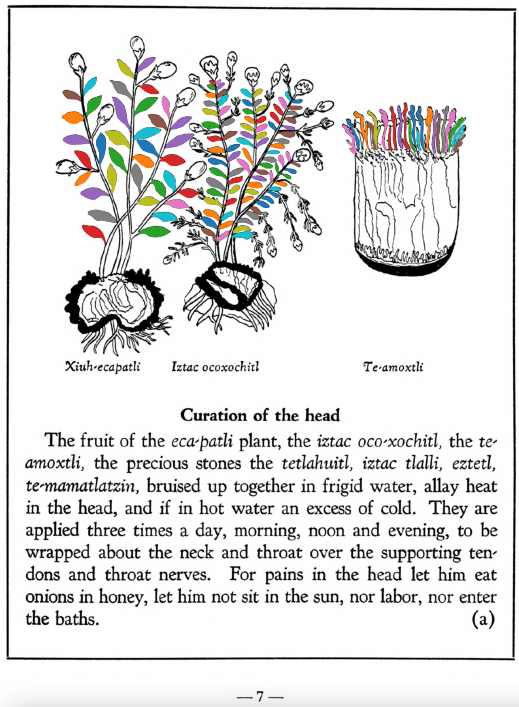

=== "English :flag_us:"
    **Curation of the head.** The fruit of the [eca-patli](Eca-patli.md) plant, the [iztac oco-xochitl](Iztac oco-xochitl.md), the [te-amoxtli](Te-amoxtli.md), the precious stones the [tetlahuitl](tetlahuitl v2.md), [iztac tlalli](iztac tlalli.md), [eztetl](eztetl.md), [te-mamatlatzin](te-mamatlatzin.md), bruised up together in frigid water, allay heat in the head, and if in hot water an excess of cold. They are applied three times a day, morning, noon and evening, to be wrapped about the neck and throat over the supporting tendons and throat nerves. For pains in the head let him eat onions in honey, let him not sit in the sun, nor labor, nor enter the baths.  
    [https://archive.org/details/aztec-herbal-of-1552/page/7](https://archive.org/details/aztec-herbal-of-1552/page/7)  

=== "Español :flag_mx:"
    **Curación de la cabeza.**  El fruto de la planta [eca-patli](Eca-patli.md), el [iztac oco-xochitl](Iztac oco-xochitl.md), el [te-amoxtli](Te-amoxtli.md), las piedras preciosas [tetlahuitl](tetlahuitl v2.md), [iztac tlalli](iztac tlalli.md), [eztetl](eztetl.md), [te-mamatlatzin](te-mamatlatzin.md), machacadas juntas en agua fría, calman el calor en la cabeza, y si se preparan en agua caliente, contrarrestan el exceso de frío. Se aplican tres veces al día, por la mañana, al mediodía y por la tarde, envueltas alrededor del cuello y la garganta sobre los tendones de sostén y los nervios del cuello. Para los dolores de cabeza, que coma cebollas con miel, que no se exponga al sol, ni realice esfuerzos, ni entre en los baños.  

  
Leaf traces by: Dan Chitwood, Michigan State University, USA  