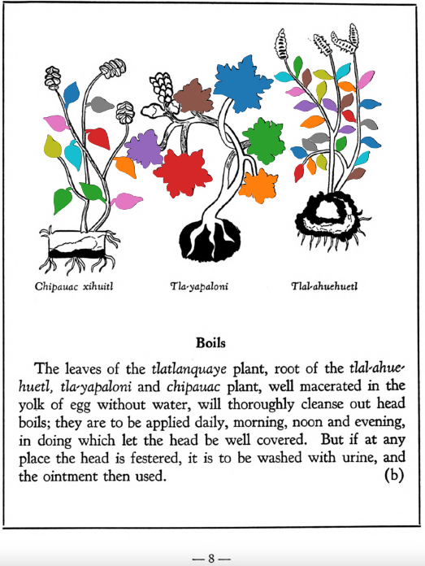

**Boils.** The leaves of the [tlatlanquaye](Tlatlanquaye.md) plant, root of the [tlal-ahuehuetl](Tlal-ahuehuetl.md), [tla-yapaloni](Tla-yapaloni.md) and [chipauac](Chipauac xihuitl.md) plant, well macerated in the yolk of egg without water, will thoroughly cleanse out head boils; they are to be applied daily, morning, noon and evening, in doing which let the head be well covered. But if at any place the head is festered, it is to be washed with urine, and the ointment then used.  
[https://archive.org/details/aztec-herbal-of-1552/page/8](https://archive.org/details/aztec-herbal-of-1552/page/8)  

  
Leaf traces by: Dan Chitwood, Michigan State University, USA  