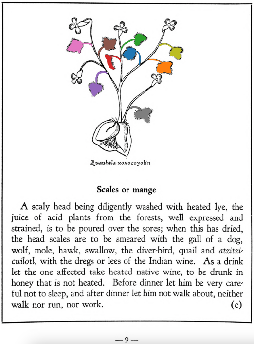

=== "English :flag_us:"
    **Scales or mange.** A scaly head being diligently washed with heated lye, the juice of acid plants from the forests, well expressed and strained, is to be poured over the sores; when this has dried, the head scales are to be smeared with the gall of a dog, wolf, mole, hawk, swallow, the diver-bird, quail and [atzitzicuilotl](atzitzicuilotl.md), with the dregs or lees of the Indian wine. As a drink let the one affected take heated native wine, to be drunk in honey that is not heated. Before dinner let him be very careful not to sleep, and after dinner let him not walk about, neither walk nor run, nor work.  
    [https://archive.org/details/aztec-herbal-of-1552/page/9](https://archive.org/details/aztec-herbal-of-1552/page/9)  

=== "Español :flag_mx:"
    **Costra o sarna.**  Una cabeza escamosa, bien lavada con lejía caliente, debe tratarse vertiendo sobre las llagas el jugo de plantas ácidas del bosque, bien exprimido y colado; una vez seco, se unta la cabeza escamosa con bilis de perro, lobo, topo, halcón, golondrina, ave zambullidora, codorniz y [atzitzicuilotl](atzitzicuilotl.md), junto con los sedimentos o heces del vino indígena. Como bebida, la persona afectada debe tomar vino indígena caliente, mezclado con miel no calentada. Antes de comer debe evitar dormir, y después de comer no debe caminar, ni correr, ni trabajar.  

  
Leaf traces by: Daniel H. Chitwood, Michigan State University, USA  