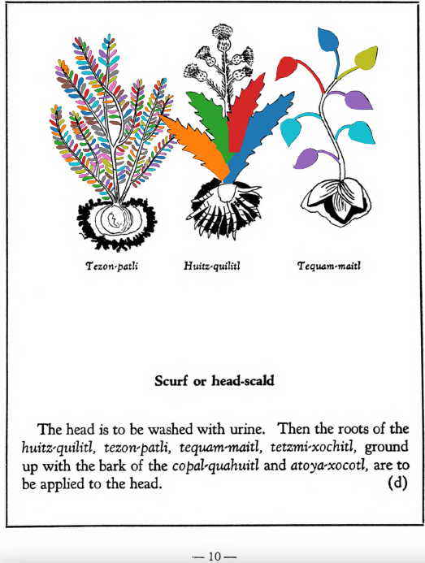

=== "English :flag_us:"
    **Scurf or head-scald.** The head is to be washed with urine. Then the roots of the [huitz-quilitl](Huitz-quilitl.md), [tezon-patli](Tezon-patli.md), [tequam-maitl](Tequam-maitl.md), [tetzmi-xochitl](Tetzmi-xochitl.md), groundup with the bark of the [copal-quahuitl](Copal-quahuitl.md) and [atoya-xocotl](Atoya-xocotl.md), are to be applied to the head.  
    [https://archive.org/details/aztec-herbal-of-1552/page/10](https://archive.org/details/aztec-herbal-of-1552/page/10)  

=== "Español :flag_mx:"
    **Tiña o escaldadura de la cabeza.**  Se debe lavar la cabeza con orina. Luego se aplican sobre la cabeza las raíces de [huitz-quilitl](Huitz-quilitl.md), [tezon-patli](Tezon-patli.md), [tequam-maitl](Tequam-maitl.md), [tetzmi-xochitl](Tetzmi-xochitl.md), molidas con la corteza de [copal-quahuitl](Copal-quahuitl.md) y [atoya-xocotl](Atoya-xocotl.md).  

  
Leaf traces by: Dan Chitwood, Michigan State University, USA  