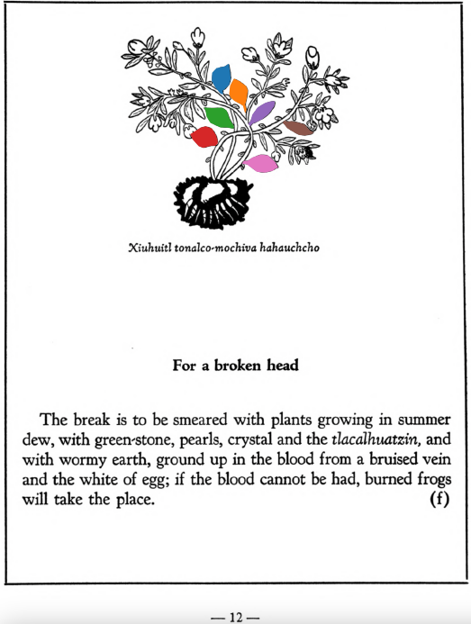

=== "English :flag_us:"
    **For a broken head.** The break is to be smeared with plants growing in summer dew, with green-stone, pearls, crystal and the [tlacalhuatzin](tlacal-huatzin.md), and with wormy earth, ground up in the blood from a bruised vein and the white of egg; if the blood cannot be had, burned frogs will take the place.  
    [https://archive.org/details/aztec-herbal-of-1552/page/12](https://archive.org/details/aztec-herbal-of-1552/page/12)  

=== "Español :flag_mx:"
    **Para una fractura en la cabeza.**  La herida se unta con plantas que crecen en el rocío de verano, con piedra verde, perlas, cristal y [tlacalhuatzin](tlacal-huatzin.md), y con tierra con lombrices, todo molido con sangre de una vena magullada y clara de huevo; si no se puede obtener sangre, se puede sustituir por ranas quemadas.  

  
Leaf traces by: Dan Chitwood, Michigan State University, USA  