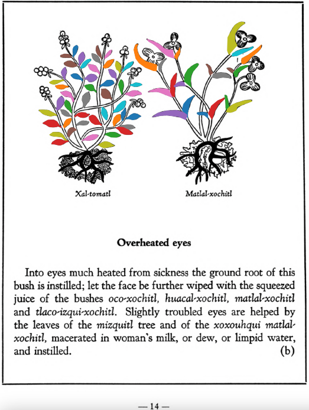

**Overheated eyes.** Into eyes much heated from sickness the ground root of this bush is instilled; let the face be further wiped with the squeezed juice of the bushes [oco-xochitl](Oco-xochitl.md), [huacal-xochitl](Huacal-xochitl.md), [matlal-xochitl](Matlal-xochitl.md)and [tlaco-izqui-xochitl](Tlaco-izqui-xochitl.md). Slightly troubled eyes are helped by the leaves of the [mizquitl](Mizquitl.md) tree and of the xoxouhqui [matlal-xochitl](Matlal-xochitl.md), macerated in woman’s milk, or dew, or limpid water, and instilled. One suffering from a defect of the eyes should abstain from sexual acts, the heat of the sun, smoke and wind, not use [chilmolli](chilmolli.md) as a sauce in his food, not eat hot foods. On his neck he must carry a red crystal, and not look at white things but black. The eye of a fox will help vitiated eyes wonderfully, being bound on the upper arm. If the eyes are so hurt that they look pulled out, pearls, reddish crystal, red mussels, the stone foundin the small bird called [molo-tototl](molo-tototl.md), the stone [tlacal-huatzin](tlacal-huatzin.md), and the stone in the stomach of the Indian dove, ground up in goose’s grease, woman’s milk and spring water, should be taken; the juice thus prepared you shall instill into the effused eyes. When then something falls into the eyes, so that they fester from it, there should be instilled liquor prepared from ground siliqua or pulse, salt and flour, in spring water. If however the trouble comes from chill, it will be corrected if reddish crystal be ground in Indian wine and the liquor dropped in the eyes.  
[https://archive.org/details/aztec-herbal-of-1552/page/14](https://archive.org/details/aztec-herbal-of-1552/page/14)  

  
Leaf traces by: Dan Chitwood, Michigan State University, USA  