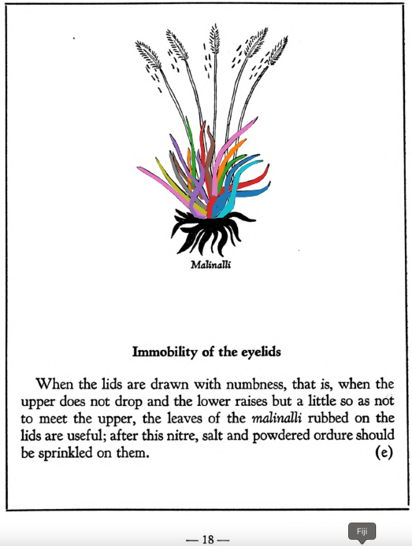

=== "English :flag_us:"
    **Immobility of the eyelids.** When the lids are drawn with numbness, that is, when the upper does not drop and the lower raises but a little so as not to meet the upper, the leaves of the [malinalli](Malinalli.md) rubbed on the lids are useful; after this nitre, salt and powdered ordure should be sprinkled on them.  
    [https://archive.org/details/aztec-herbal-of-1552/page/18](https://archive.org/details/aztec-herbal-of-1552/page/18)  

=== "Español :flag_mx:"
    **Parálisis de los párpados.** Cuando los párpados se entumecen, es decir, cuando el superior no cae y el inferior apenas sube, sin llegar a cerrarse, es útil frotar sobre ellos hojas de [malinalli](Malinalli.md); después se espolvorea salitre, sal y excremento seco.  

  
Leaf traces by: Daniel H. Chitwood, Michigan State University, USA  