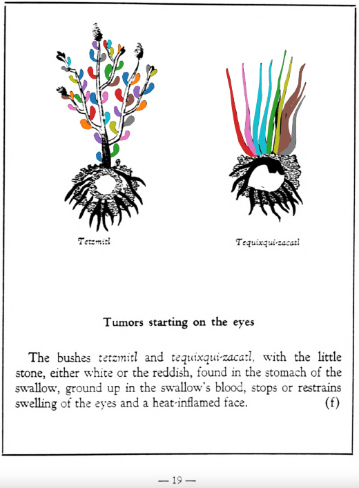

=== "English :flag_us:"
    **Tumors starting on the eyes.** The bushes [tetzmitl](Tetzmitl.md) and [tequixqui-zacatl](Tequixqui-zacatl.md), with the little stone, either white or the reddish, found in the stomach of the swallow, ground up in the swallow’s blood, stops or restrains swelling of the eyes and a heat-inflamed face.  
    [https://archive.org/details/aztec-herbal-of-1552/page/19](https://archive.org/details/aztec-herbal-of-1552/page/19)  

=== "Español :flag_mx:"
    **Tumores que comienzan en los ojos.** Los arbustos [tetzmitl](Tetzmitl.md) y [tequixqui-zacatl](Tequixqui-zacatl.md), junto con la piedrecilla, ya sea blanca o rojiza, encontrada en el estómago de la golondrina, molidos en sangre de golondrina, detienen o reducen la hinchazón de los ojos y el enrojecimiento del rostro.  

  
Leaf traces by: Daniel H. Chitwood, Michigan State University, USA  