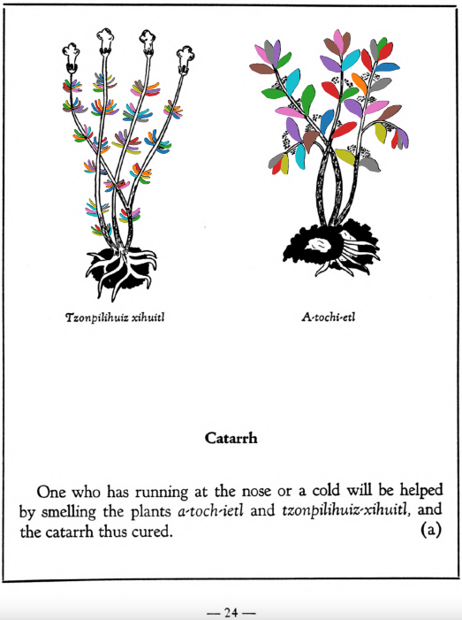

**Catarrh.** One who has running at the nose or a cold will be helped by smelling the plants [a-toch-ietl](A-toch-ietl.md) and [tzonpilihuiz-xihuitl](Tzon-pilihuiz-xihuitl.md), andthe catarrh thus cured.  
[https://archive.org/details/aztec-herbal-of-1552/page/24](https://archive.org/details/aztec-herbal-of-1552/page/24)  

  
Leaf traces by: Dan Chitwood, Michigan State University, USA  