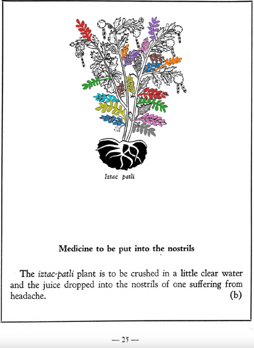

=== "English :flag_us:"
    **Medicine to be put into the nostrils.** The [iztac-patli](Iztac-patli.md) plant is to be crushed in a little clear water and the juice dropped into the nostrils of one suffering from headache.  
    [https://archive.org/details/aztec-herbal-of-1552/page/25](https://archive.org/details/aztec-herbal-of-1552/page/25)  

=== "Español :flag_mx:"
    **Medicina para colocar en las narices.** La planta [iztac-patli](Iztac-patli.md) debe triturarse en un poco de agua clara y su jugo se instila en las narices de quien sufre de dolor de cabeza.  

  
Leaf traces by: Dan Chitwood, Michigan State University, USA  