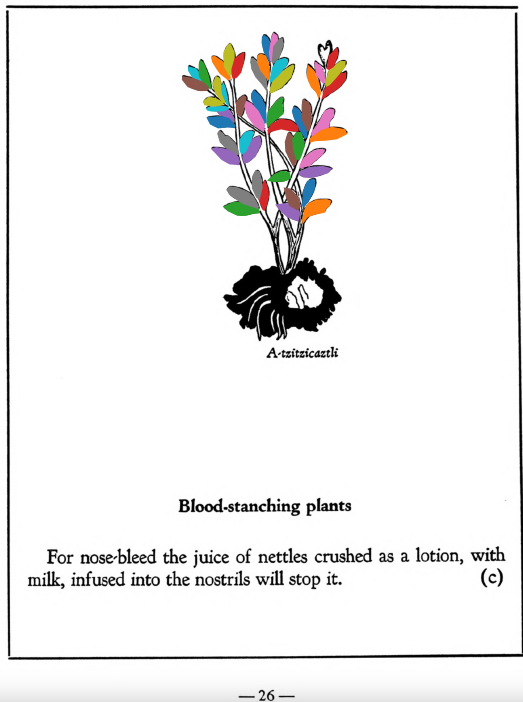

=== "English :flag_us:"
    **Blood-stanching plants.** For nose-bleed the juice of nettles crushed as a lotion, with milk, infused into the nostrils will stop it.  
    [https://archive.org/details/aztec-herbal-of-1552/page/26](https://archive.org/details/aztec-herbal-of-1552/page/26)  

=== "Español :flag_mx:"
    **Plantas para detener el sangrado.** Para el sangrado nasal, el jugo de ortigas trituradas como loción, con leche, instilado en las narices, lo detendrá.  

  
Leaf traces by: Dan Chitwood, Michigan State University, USA  