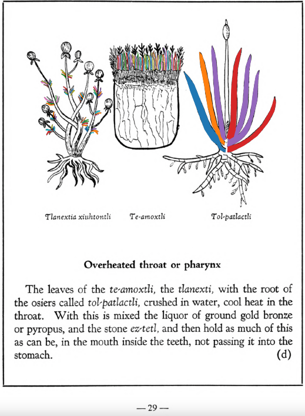

**Overheated throat or pharynx.** The leaves of the [te-amoxtli](Te-amoxtli.md), the [tlanexti](Tlanextia_xiuhtontli.md), with the root ofthe osiers called [tol-patlactli](Tol-patlactli.md), crushed in water, cool heat in the throat. With this is mixed the liquor of ground gold bronze or pyropus, and the stone [ez-tetl](eztetl.md), and then hold as much of this as can be, in the mouth inside the teeth, not passing it into the stomach.  
[https://archive.org/details/aztec-herbal-of-1552/page/29](https://archive.org/details/aztec-herbal-of-1552/page/29)  

  
Leaf traces by: Dan Chitwood, Michigan State University, USA  