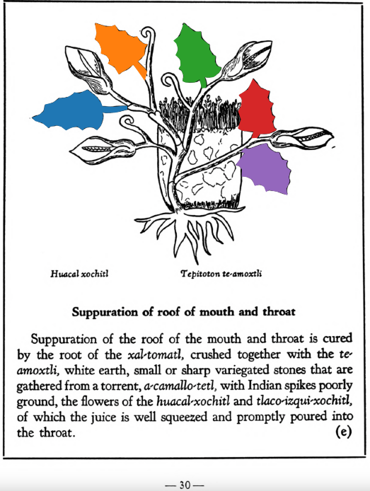

**Suppuration of roof of mouth and throat.** Suppuration of the roof of the mouth and throat is cured by the root of the [xal-tomatl](Xal-tomatl.md), crushed together with the [te-amoxtli](Te-amoxtli.md), white earth, small or sharp variegated stones that are gathered from a torrent, [a-camallo-tetl](a-camallo-tetl v2.md), with Indian spikes poorly ground, the flowers of the [huacal-xochitl](Huacal-xochitl.md) and [tlaco-izqui-xochitl](Tlaco-izqui-xochitl.md), of which the juice is well squeezed and promptly poured into the throat.  
[https://archive.org/details/aztec-herbal-of-1552/page/30](https://archive.org/details/aztec-herbal-of-1552/page/30)  

  
Leaf traces by: Dan Chitwood, Michigan State University, USA  