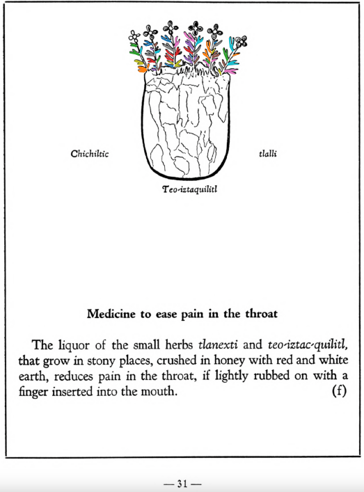

**Medicine to ease pain in the throat.** The liquor of the small herbs [tlanexti](Tlanextia_xiuhtontli.md) and [teo-iztac-quilitl](Teo-iztaquilitl.md), that grow in stony places, crushed in honey with red and white earth, reduces pain in the throat, if lightly rubbed on with a finger inserted into the mouth.  
[https://archive.org/details/aztec-herbal-of-1552/page/31](https://archive.org/details/aztec-herbal-of-1552/page/31)  

  
Leaf traces by: Dan Chitwood, Michigan State University, USA  