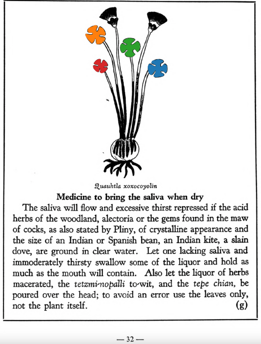

=== "English :flag_us:"
    **Medicine to bring the saliva when dry.** The saliva will flow and excessive thirst repressed if the acid herbs of the woodland, alectoria or the gems found in the maw of cocks, as also stated by Pliny, of crystalline appearance and the size of an Indian or Spanish bean, an Indian kite, a slain dove, are ground in clear water. Let one lacking saliva and immoderately thirsty swallow some of the liquor and hold as much as the mouth will contain. Also let the liquor of herbs macerated, the [tetzmi-nopalli](Tetzmi-nopalli.md) to wit, and the tepe chian, be poured over the head; to avoid an error use the leaves only, not the plant itself.  
    [https://archive.org/details/aztec-herbal-of-1552/page/32](https://archive.org/details/aztec-herbal-of-1552/page/32)  

=== "Español :flag_mx:"
    **Medicina para hacer volver la saliva cuando se ha secado.** La saliva fluirá y se reprimirá la sed excesiva si las hierbas ácidas del bosque, la alectoria o las gemas halladas en el buche de los gallos —como también lo dice Plinio—, de aspecto cristalino y tamaño de un frijol indio o español, un milano indio, una paloma sacrificada, se muelen en agua clara. Quien carezca de saliva o sufra sed immoderada debe tragar un poco de este licor y mantener tanto como quepa en la boca. También debe verterse sobre la cabeza el licor de hierbas maceradas, a saber, el [tetzmi-nopalli](Tetzmi-nopalli.md) y el tepe chian; para evitar errores, se deben usar solo las hojas, no toda la planta.  

  
Leaf traces by: Dan Chitwood, Michigan State University, USA  