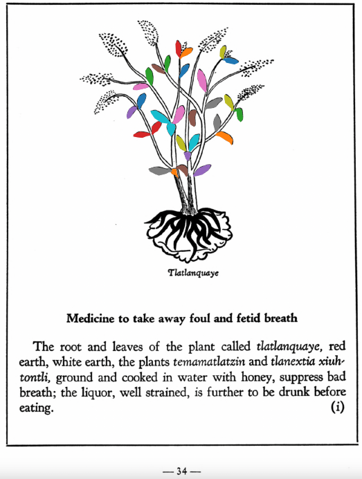

=== "English :flag_us:"
    **Medicine to take away foul and fetid breath.** The root and leaves of the plant called [tlatlanquaye](Tlatlanquaye.md), red earth, white earth, the plants [temamatlatzin](Temamatlatzin.md) and [tlanextia xiuhtontli](Tlanextia xiuhtontli.md) ground and cooked in water with honey, suppress bad breath; the liquor, well strained, is further to be drunk before eating.  
    [https://archive.org/details/aztec-herbal-of-1552/page/34](https://archive.org/details/aztec-herbal-of-1552/page/34)  

=== "Español :flag_mx:"
    **Medicina para eliminar el aliento fétido y maloliente.** La raíz y las hojas de la planta llamada [tlatlanquaye](Tlatlanquaye.md), tierra roja, tierra blanca, las plantas [temamatlatzin](Temamatlatzin.md) y [tlanextia xiuhtontli](Tlanextia xiuhtontli.md), molidas y cocidas en agua con miel, suprimen el mal aliento; el licor, bien colado, también debe beberse antes de comer.  

  
Leaf traces by: Dan Chitwood, Michigan State University, USA  