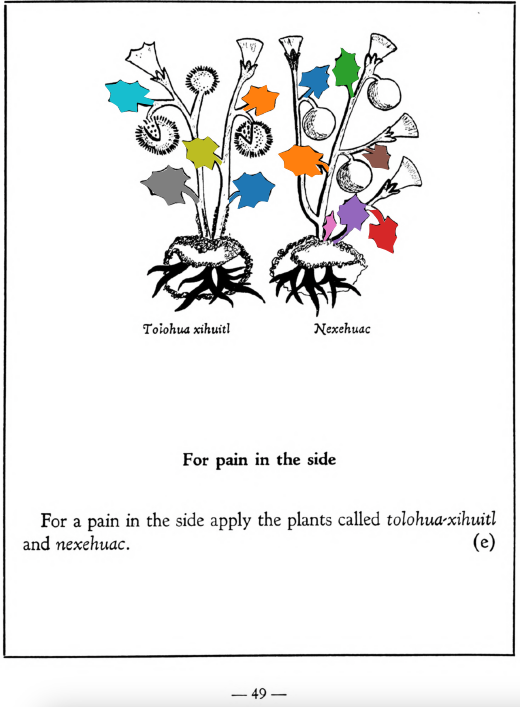

=== "English :flag_us:"
    **For pain in the side.** For a pain in the side apply the plants called [tolohua-xihuitl](Tolohua xihuitl.md) and [nexehuac](Nexehuac.md).  
    [https://archive.org/details/aztec-herbal-of-1552/page/49](https://archive.org/details/aztec-herbal-of-1552/page/49)  

=== "Español :flag_mx:"
    **Para dolor en el costado.** Para un dolor en el costado se aplican las plantas llamadas [tolohua-xihuitl](Tolohua xihuitl.md) y [nexehuac](Nexehuac.md).  

  
Leaf traces by: J. Noé García-Chávez, Laboratory of Agrigenomic Sciences, ENES Unidad León, México  