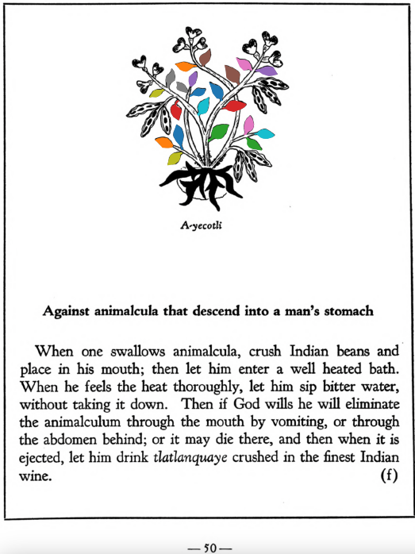

=== "English :flag_us:"
    **Against animalcula that descend into a man’s stomach.** When one swallows animalcula, crush Indian beans and place in his mouth; then let him enter a well heated bath. When he feels the heat thoroughly, let him sip bitter water, without taking it down. Then if God wills he will eliminate the animalculum through the mouth by vomiting, or through the abdomen behind; or it may die there, and then when it is ejected, let him drink [tlatlanquaye](Tlatlanquaye.md) crushed in the finest Indian wine.  
    [https://archive.org/details/aztec-herbal-of-1552/page/50](https://archive.org/details/aztec-herbal-of-1552/page/50)  

=== "Español :flag_mx:"
    **Contra los animalillos que descienden al estómago del hombre.** Cuando alguien traga animalillos, se machacan frijoles indios y se colocan en su boca; luego debe entrar a un baño bien calentado. Cuando sienta el calor a fondo, debe sorber agua amarga, sin tragarla. Entonces, si Dios quiere, eliminará el animalillo por la boca mediante el vómito, o por el abdomen hacia atrás; o puede que muera allí, y luego, al ser expulsado, que beba [tlatlanquaye](Tlatlanquaye.md) machacado en el vino indígena más fino.  

  
Leaf traces by: Noé García, UNAM ENES León, México  