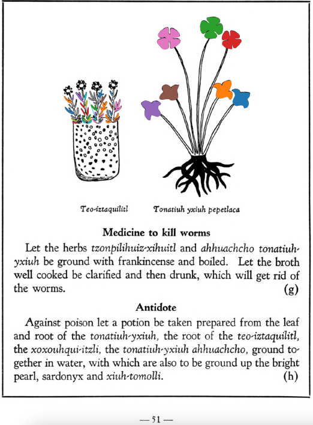

=== "English :flag_us:"
    **Medicine to kill worms.** Let the herbs [tzonpilihuiz-xihuitl](Tzon-pilihuiz-xihuitl.md) and ahhuachcho tonatiuh-yxiuh be ground with frankincense and boiled. Let the broth well cooked be clarified and then drunk, which will get rid of the worms.  
    [https://archive.org/details/aztec-herbal-of-1552/page/51](https://archive.org/details/aztec-herbal-of-1552/page/51)  

=== "Español :flag_mx:"
    **Medicina para matar lombrices.** Las hierbas [tzonpilihuiz-xihuitl](Tzon-pilihuiz-xihuitl.md) y ahhuachcho tonatiuh-yxiuh se trituran con incienso y se hierven. El caldo bien cocido se clarifica y luego se bebe, lo cual eliminará las lombrices.  

  
Leaf traces by: J. Noé García-Chávez, Laboratory of Agrigenomic Sciences, ENES Unidad León, México  