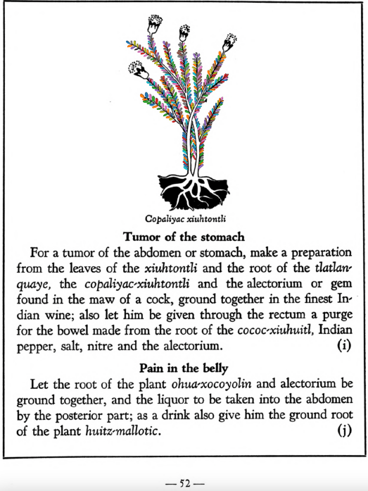

=== "English :flag_us:"
    **Pain in the belly.** Let the root of the plant [ohua-xocoyolin](Ohua-xoxocoyolin.md) and alectorium be ground together, and the liquor to be taken into the abdomen by the posterior part; as a drink also give him the ground root of the plant [huitz-mallotic](Huihuitz-mallotic.md).  
    [https://archive.org/details/aztec-herbal-of-1552/page/52](https://archive.org/details/aztec-herbal-of-1552/page/52)  

=== "Español :flag_mx:"
    **Dolor en el vientre.** La raíz de la planta [ohua-xocoyolin](Ohua-xoxocoyolin.md) y el alectorium se trituran juntos, y el licor se introduce en el abdomen por la parte posterior; como bebida también se le da la raíz triturada de la planta [huitz-mallotic](Huihuitz-mallotic.md).  

  
Leaf traces by: J. Noé García-Chávez, Laboratory of Agrigenomic Sciences, ENES Unidad León, México  