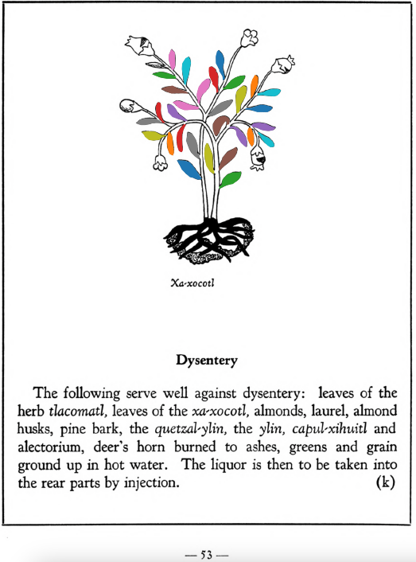

=== "English :flag_us:"
    **Dysentery.** The following serve well against dysentery: leaves of the herb [tlacomatl](Tlaco-amatl.md), leaves of the [xa-xocotl](Xa-xocotl.md), almonds, laurel, almond husks, pine bark, the [quetzal-ylin](Quetzal-ylin.md), the [ylin](Ylin.md), [capul-xihuitl](Capul-xihuitl.md) and alectorium, deer’s horn burned to ashes, greens and grain ground up in hot water. The liquor is then to be taken into the rear parts by injection.  
    [https://archive.org/details/aztec-herbal-of-1552/page/53](https://archive.org/details/aztec-herbal-of-1552/page/53)  

=== "Español :flag_mx:"
    **Diarrea disenteriforme.** Contra la disentería sirven bien: hojas de la hierba [tlacomatl](Tlaco-amatl.md), hojas del [xa-xocotl](Xa-xocotl.md), almendras, laurel, cáscaras de almendra, corteza de pino, el [quetzal-ylin](Quetzal-ylin.md), el [ylin](Ylin.md), [capul-xihuitl](Capul-xihuitl.md) y alectorium, cuerno de venado quemado hasta cenizas, verduras y granos triturados en agua caliente. El licor se administra por las partes traseras mediante inyección.  

  
Leaf traces by: J. Noé García-Chávez, Laboratory of Agrigenomic Sciences, ENES Unidad León, México  