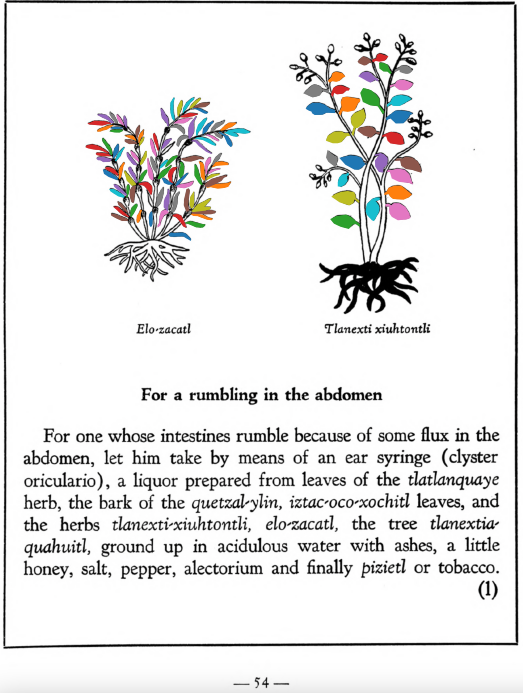

=== "English :flag_us:"
    **For a rumbling in the abdomen.** For one whose intestines rumble because of some flux in the abdomen, let him take by means of an ear syringe (clyster oriculario), a liquor prepared from leaves of the [tlatlanquaye](Tlatlanquaye.md) herb, the bark of the [quetzal-ylin](Quetzal-ylin.md), [iztac-oco-xochitl](Iztac oco-xochitl.md) leaves, and the herbs [tlanexti-xiuhtontli](Tlanextia xiuhtontli.md), [elo-zacatl](Elo-zacatl.md), the tree [tlanextia-quahuitl](Tlanextia quahuitl.md), ground up in acidulous water with ashes, a little honey, salt, pepper, alectorium and finally [pizietl](Piciyetl.md) or tobacco.  
    [https://archive.org/details/aztec-herbal-of-1552/page/54](https://archive.org/details/aztec-herbal-of-1552/page/54)  

=== "Español :flag_mx:"
    **Para retortijones en el abdomen.** A quien se le revuelven las tripas por algún flujo abdominal, que se le administre con una jeringa auricular un licor preparado con hojas de la hierba [tlatlanquaye](Tlatlanquaye.md), corteza del [quetzal-ylin](Quetzal-ylin.md), hojas del [iztac-oco-xochitl](Iztac oco-xochitl.md), y las hierbas [tlanexti-xiuhtontli](Tlanextia xiuhtontli.md), [elo-zacatl](Elo-zacatl.md), el árbol [tlanextia-quahuitl](Tlanextia quahuitl.md), todo triturado en agua acidulada con cenizas, un poco de miel, sal, pimienta, alectorium y finalmente [pizietl](Piciyetl.md) o tabaco.  

  
Leaf traces by: J. Noé García-Chávez, Laboratory of Agrigenomic Sciences, ENES Unidad León, México  