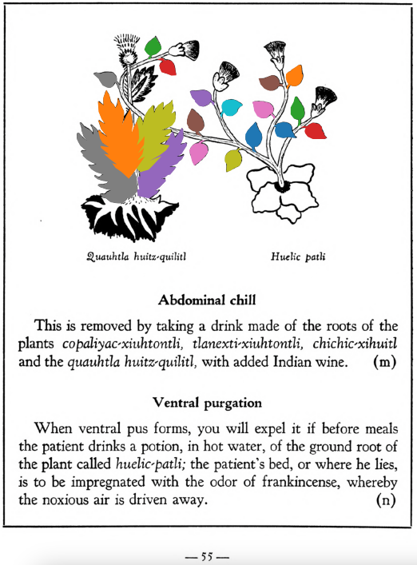

=== "English :flag_us:"
    **Abdominal chill.** This is removed by taking a drink made of the roots of the plants [copaliyac-xiuhtontli](Copaliyac-xiuhtontli.md), [tlanexti-xiuhtontli](Tlanextia xiuhtontli.md), [chichic-xihuitl](Chichic-xihuitl.md) and the [quauhtla huitz-quilitl](Quauhtla huitz-quilitl.md), with added Indian wine.  
    [https://archive.org/details/aztec-herbal-of-1552/page/55](https://archive.org/details/aztec-herbal-of-1552/page/55)  

=== "Español :flag_mx:"
    **Frialdad abdominal.** Esto se remueve tomando una bebida hecha de las raíces de las plantas [copaliyac-xiuhtontli](Copaliyac-xiuhtontli.md), [tlanexti-xiuhtontli](Tlanextia xiuhtontli.md), [chichic-xihuitl](Chichic-xihuitl.md) y del [quauhtla huitz-quilitl](Quauhtla huitz-quilitl.md), con vino indígena añadido.  

  
Leaf traces by: J. Noé García-Chávez, Laboratory of Agrigenomic Sciences, ENES Unidad León, México  