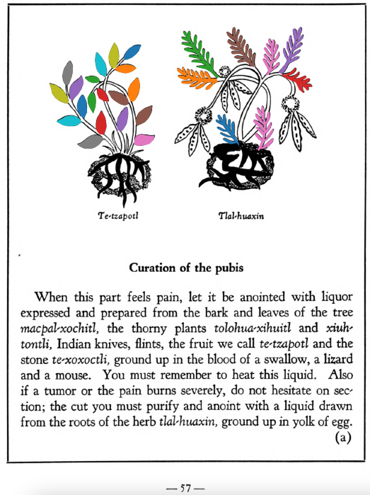

=== "English :flag_us:"
    **Curation of the pubis.** When this part feels pain, let it be anointed with liquor expressed and prepared from the bark and leaves of the tree [macpal-xochitl](Macpal-xochitl.md), the thorny plants [tolohua-xihuitl](Tolohua xihuitl.md) and [xiuh-tontli](Xiuhtontli.md), Indian knives, flints, the fruit we call [te-tzapotl](Te-tzapotl.md) and the stone [te-xoxoctli](te-xoxoctli.md), ground up in the blood of a swallow, a lizard and a mouse. You must remember to heat this liquid. Also if a tumor or the pain burns severely, do not hesitate on section; the cut you must purify and anoint with a liquid drawn from the roots of the herb [tlal-huaxin](Tlal-huaxin.md), ground up in yolk of egg.  
    [https://archive.org/details/aztec-herbal-of-1552/page/57](https://archive.org/details/aztec-herbal-of-1552/page/57)  

=== "Español :flag_mx:"
    **Curación del pubis.** Cuando esta parte duele, debe ungirse con un licor extraído y preparado de la corteza y hojas del árbol [macpal-xochitl](Macpal-xochitl.md), las plantas espinosas [tolohua-xihuitl](Tolohua xihuitl.md) y [xiuh-tontli](Xiuhtontli.md), cuchillos de obsidiana, pedernales, el fruto llamado [te-tzapotl](Te-tzapotl.md) y la piedra [te-xoxoctli](te-xoxoctli.md), todo molido en la sangre de una golondrina, una lagartija y un ratón. Debes recordar calentar este líquido. Además, si hay un tumor o el dolor quema intensamente, no se debe dudar en hacer una incisión; la herida debe purificarse y ungirse con un líquido extraído de las raíces de la hierba [tlal-huaxin](Tlal-huaxin.md), molidas en yema de huevo.  

  
Leaf traces by: J. Noé García-Chávez, Laboratory of Agrigenomic Sciences, ENES Unidad León, México  