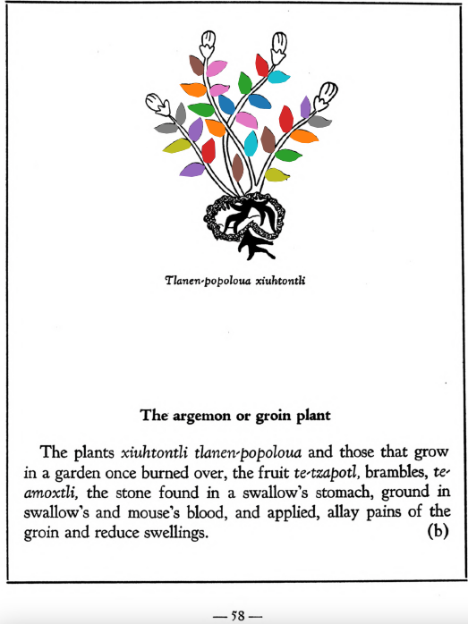

=== "English :flag_us:"
    **The argemon or groin plant.** The plants xiuhtontli tlanen-popoloua and those that grow in a garden once burned over, the fruit [te-tzapotl](Te-tzapotl.md), brambles, [te-amoxtli](Te-amoxtli.md), the stone found in a swallow’s stomach, ground in swallow’s and mouse’s blood, and applied, allay pains of the groin and reduce swellings.  
    [https://archive.org/details/aztec-herbal-of-1552/page/58](https://archive.org/details/aztec-herbal-of-1552/page/58)  

=== "Español :flag_mx:"
    **La argemona o planta de la ingle.** Las plantas xiuhtontli tlanen-popoloua y aquellas que crecen en un jardín previamente quemado, el fruto [te-tzapotl](Te-tzapotl.md), zarzas, [te-amoxtli](Te-amoxtli.md), la piedra que se encuentra en el estómago de la golondrina, todo molido en sangre de golondrina y ratón, y aplicado, alivian los dolores de la ingle y reducen las hinchazones.  

  
Leaf traces by: J. Noé García-Chávez, Laboratory of Agrigenomic Sciences, ENES Unidad León, México  