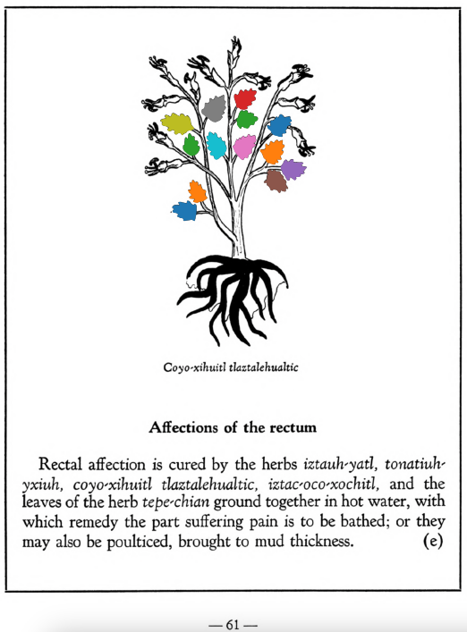

**Affections of the rectum.** Rectal affection is cured by the herbs [iztauh-yatl](Iztauyattl.md), [tonatiuh-yxiuh](Tonatiuh yxiuh v1.md), coyo-xihuitl tlaztalehualtic, [iztac-oco-xochitl](Iztac oco-xochitl.md), and the leaves of the herb [tepe-chian](Tepe-chian.md) ground together in hot water, with which remedy the part suffering pain is to be bathed; or they may also be poulticed, brought to mud thickness.  
[https://archive.org/details/aztec-herbal-of-1552/page/61](https://archive.org/details/aztec-herbal-of-1552/page/61)  

  
Leaf traces by: Mariana Ruíz Amaro, UNAM ENES León, México  