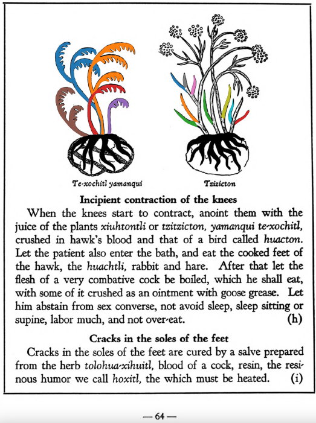

**Incipient contraction of the knees.** When the knees start to contract, anoint them with the juice of the plants [xiuhtontli](Xiuhtontli.md) or [tzitzicton](Tzitzicton.md), yamanqui te-xochitl, crushed in hawk’s blood and that of a bird called [huacton](huacton.md). Let the patient also enter the bath, and eat the cooked feet of the hawk, the huachtli, rabbit and hare. After that let the flesh of a very combative cock be boiled, which he shall eat, with some of it crushed as an ointment with goose grease. Let him abstain from sex converse, not avoid sleep, sleep sitting or supine, labor much, and not overheat.  
[https://archive.org/details/aztec-herbal-of-1552/page/64](https://archive.org/details/aztec-herbal-of-1552/page/64)  

  
Leaf traces by: Mariana Ruíz Amaro, UNAM ENES León, México  