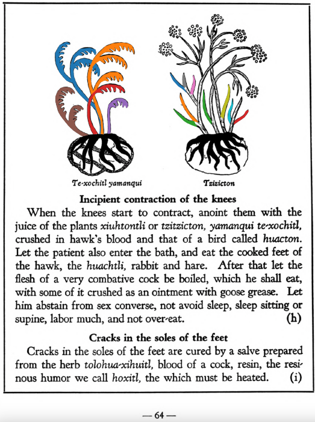

=== "English :flag_us:"
    **Cracks in the soles of the feet.** Cracks in the soles of the feet are cured by a salve prepared from the herb [tolohua-xihuitl](Tolohua xihuitl.md), blood of a cock, resin, the resinous humor we call [hoxitl](hoxitl.md), the which muist be heated.  
    [https://archive.org/details/aztec-herbal-of-1552/page/64](https://archive.org/details/aztec-herbal-of-1552/page/64)  

=== "Español :flag_mx:"
    **Grietas en las plantas de los pies.** Las grietas en las plantas de los pies se curan con un ungüento preparado con la hierba [tolohua-xihuitl](Tolohua xihuitl.md), sangre de gallo, resina, y el humor resinoso llamado [hoxitl](hoxitl.md), el cual debe calentarse.  

  
Leaf traces by: Mariana Ruíz Amaro, UNAM ENES León, México  