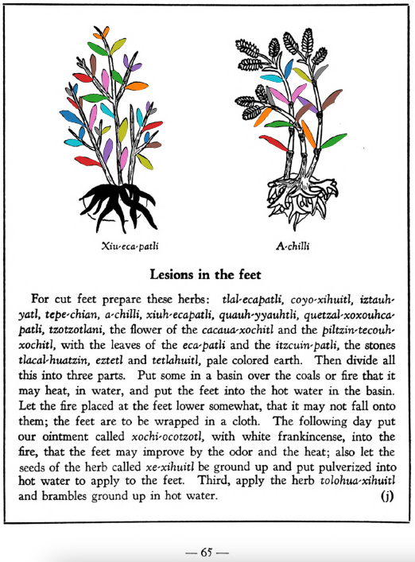

**Lesions in the feet.** For cut feet prepare these herbs: [tlal-ecapatli](Tlal-ecapatli.md), [coyo-xihuitl](Coyo-xihuitl.md), [iztauh-yatl](Iztauyattl.md), [tepe-chian](Tepe-chian.md), [a-chilli](A-chilli.md), [xiuh-ecapatli](Eca-patli.md), [quauh-yyauhtli](Quauh-yyauhtli.md), [quetzal-xoxouhca-patli](Quetzal-xoxouca-patli.md), [tzotzotlani](Quetzal-xoxouhca-patli_tzotzotlani.md), the flower of the [cacau-xochitl](Cacaua-xochitl.md) and the [piltzin-tecouh-xochitl](Piltzinte-couh-xochitl.md), with the leaves of the [eca-patli](Eca-patli.md) and the [itzcuin-patli](Itzquin-patli.md), the stones [tlacal-huatzin](tlacal-huatzin.md), [eztetl](eztetl.md) and [tetlahuitl](tetlahuitl_v2.md), pale colored earth. Then divide all this into three parts. Put some in a basin over the coals or fire that it may heat, in water, and put the feet into the hot water in the basin. Let the fire placed at the feet lower somewhat, that it may not fall onto them; the feet are to be wrapped in a cloth. The following day put our ointment called [xochi-ocotzotl](xochi-ocotzotl.md), with white frankincense, into the fire, that the feet may improve by the odor and the heat; also let the seeds of the herb called [xe-xihuitl](Xe-xihuitl.md) be ground up and put pulverized into hot water to apply to the feet. Third, apply the herb[tolohua-xihuitl](Tolohua_xihuitl.md)and brambles ground up in hot water.  
[https://archive.org/details/aztec-herbal-of-1552/page/65](https://archive.org/details/aztec-herbal-of-1552/page/65)  

  
Leaf traces by: Mariana Ruíz Amaro, UNAM ENES León, México  