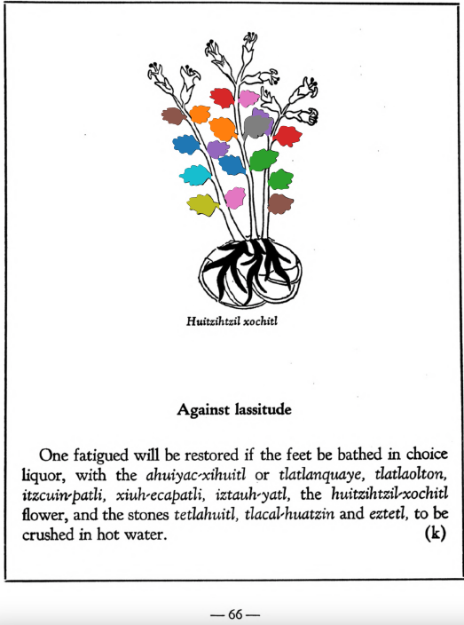

**Against lassitude.** One fatigued will be restored if the feet be bathed in choice liquor, with the [ahuiyac-xihuitl](Ahuiyac-xihuitl.md) or [tlatlanquaye](Tlatlanquaye.md), [tlatlaolton](Tlatlaolton.md), [itzcuin-patli](Itzquin-patli.md), [xiuh-ecapatli](Eca-patli.md), [iztauh-yatl](Iztauyattl.md), the [huitzihtzil-xochitl](Huitzihtzil-xochitl.md)flower, and the stones [tetlahuitl](tetlahuitl_v2.md), [tlaca-huatzin](tlacal-huatzin.md) and [eztetl](eztetl.md), to be crushed in hot water.  
[https://archive.org/details/aztec-herbal-of-1552/page/66](https://archive.org/details/aztec-herbal-of-1552/page/66)  

  
Leaf traces by: Mariana Ruíz Amaro, UNAM ENES León, México  