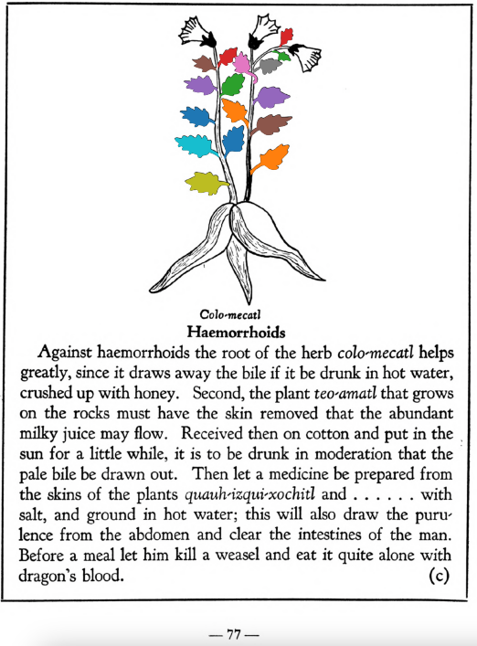

**Haemorrhoids.** Against haemorrhoids the root of the herb [colo-mecatl](Colo-mecatl.md) helps greatly, since it draws away the bile if it be drunk in hot water, crushed up with honey. Second, the plant [teo-amatl](Teo-amatl.md) that grows on the rocks must have the skin removed that the abundant milky juice may flow. Received then on cotton and put in the sun for a little while, it is to be drunk in moderation that the pale bile be drawn out. Then let a medicine be prepared from the skins of the plants [quauh-izqui-xochitl](Quauh-izqui-xochitl.md) and . . . . . . with salt, and ground in hot water; this will also draw the purulence from the abdomen and clear the intestines of the man. Before a meal let him kill a weasel and eat it quite alone with qdragon’s blood.  
[https://archive.org/details/aztec-herbal-of-1552/page/77](https://archive.org/details/aztec-herbal-of-1552/page/77)  

  
Leaf traces by: Kylie DeViller, Acadia University, Canada  