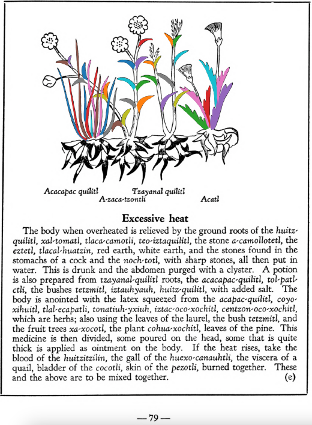

=== "English :flag_us:"
    **Excessive heat.** The body when overheated is relieved by the ground roots of the [huitz-quilitl](Huitz-quilitl.md), [xal-tomatl](Xal-tomatl.md), [tlaca-camotli](Tlaca-camotli.md), [teo-iztaquilitl](Teo-iztaquilitl.md), the stone a-camollotetl, the [eztetl](eztetl.md), [tlacal-huatzin](tlacal-huatzin.md), red earth, white earth, and the stones found in the stomachs of a cock and the [noch-totl](noch-tototl.md), with sharp stones, all then put in water. This is drunk and the abdomen purged with a clyster. A potion is also prepared from [tzayanal-quilitl](Tzayanal-quilitl.md) roots, the [acacapac-quilitl](Aca-capac-quilitl.md), [tol-patlctli](Tol-patlactli.md), the bushes [tetzmitl](Tetzmitl.md), [iztauhyauh](Iztauyattl.md), [huitz-quilitl](Huitz-quilitl.md), with added salt. The body is anointed with the latex squeezed from the [acapac-quilitl](Aca-capac-quilitl.md), [coyo-xihuitl](Coyo-xihuitl.md), [tlal-ecapatli](Tlal-ecapatli.md), [tonatiuh-yxiuh](Tonatiuh yxiuh v1.md), [iztac-oco-xochitl](Iztac oco-xochitl.md), [centzon-oco-xochitl](Centzon-oco-xochitl.md), which are herbs; also using the leaves of the laurel, the bush [tetzmitl](Tetzmitl.md), and the fruit trees [xa-xocotl](Xa-xocotl.md), the plant [cohua-xochitl](Cohua-xochitl.md), leaves of the pine. This medicine is then divided, some poured on the head, some that is quite thick is applied as ointment on the body. If the heat rises, take the blood of the [huitzitzilin](huitzitzilin.md), the gall of the [huexo-canauhtli](huexo-canauhtli.md), the viscera of a quail, bladder of the [cocotli](cocotli.md), skin of the [pezotli](pezotli.md), burned together. These and the above are to be mixed together.  
    [https://archive.org/details/aztec-herbal-of-1552/page/79](https://archive.org/details/aztec-herbal-of-1552/page/79)  

=== "Español :flag_mx:"
    **Calor excesivo.** El cuerpo cuando está sobrecalentado se alivia con las raíces molidas del [huitz-quilitl](Huitz-quilitl.md), [xal-tomatl](Xal-tomatl.md), [tlaca-camotli](Tlaca-camotli.md), [teo-iztaquilitl](Teo-iztaquilitl.md), la piedra a-camollotetl, el [eztetl](eztetl.md), [tlacal-huatzin](tlacal-huatzin.md), tierra roja, tierra blanca, y las piedras encontradas en los estómagos de un gallo y del [noch-totl](noch-tototl.md), con piedras filosas, todo esto se pone en agua. Se bebe esta preparación y el abdomen se purga con un enema. También se prepara una poción con raíces de [tzayanal-quilitl](Tzayanal-quilitl.md), el [acacapac-quilitl](Aca-capac-quilitl.md), [tol-patlctli](Tol-patlactli.md), los arbustos [tetzmitl](Tetzmitl.md), [iztauhyauh](Iztauyattl.md), [huitz-quilitl](Huitz-quilitl.md), con sal añadida. El cuerpo se unta con el látex exprimido del [acapac-quilitl](Aca-capac-quilitl.md), [coyo-xihuitl](Coyo-xihuitl.md), [tlal-ecapatli](Tlal-ecapatli.md), [tonatiuh-yxiuh](Tonatiuh yxiuh v1.md), [iztac-oco-xochitl](Iztac oco-xochitl.md), [centzon-oco-xochitl](Centzon-oco-xochitl.md), que son hierbas; también se usan las hojas de laurel, el arbusto [tetzmitl](Tetzmitl.md), y los árboles frutales [xa-xocotl](Xa-xocotl.md), la planta [cohua-xochitl](Cohua-xochitl.md), hojas de pino. Esta medicina se divide, una parte se vierte en la cabeza, otra más espesa se aplica como ungüento en el cuerpo. Si el calor aumenta, se toma la sangre del [huitzitzilin](huitzitzilin.md), la bilis del [huexo-canauhtli](huexo-canauhtli.md), las vísceras de una codorniz, la vejiga del [cocotli](cocotli.md), la piel del [pezotli](pezotli.md), todo quemado junto. Estos y los anteriores se mezclan.  

  
Leaf traces by: Kylie DeViller, Jodrey School of Computer Science, Acadia University, Canada  