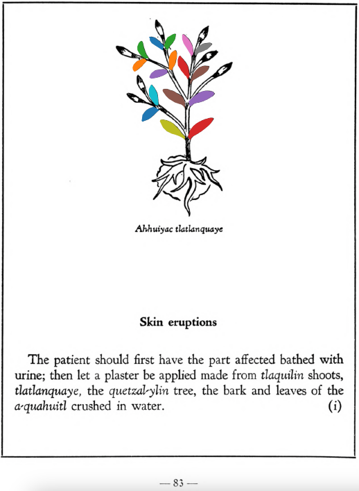

=== "English :flag_us:"
    **Skin eruptions.** The patient should first have the part affected bathed with urine; then let a plaster be applied made from [tlaquilin](Tlaquilin.md) shoots, [tlatlanquaye](Tlatlanquaye.md), the [quetzal-ylin](Quetzal-ylin.md) tree, the bark and leaves of the [a-quahuitl](A-quahuitl.md) crushed in water.  
    [https://archive.org/details/aztec-herbal-of-1552/page/83](https://archive.org/details/aztec-herbal-of-1552/page/83)  

=== "Español :flag_mx:"
    **Erupciones cutáneas.** El paciente debe primero tener la parte afectada bañada con orina; luego se debe aplicar un emplasto hecho de brotes de [tlaquilin](Tlaquilin.md), [tlatlanquaye](Tlatlanquaye.md), el árbol [quetzal-ylin](Quetzal-ylin.md), la corteza y hojas del [a-quahuitl](A-quahuitl.md) triturados en agua.  

  
Leaf traces by: Lachlann Simms, Acadia University, Canada  