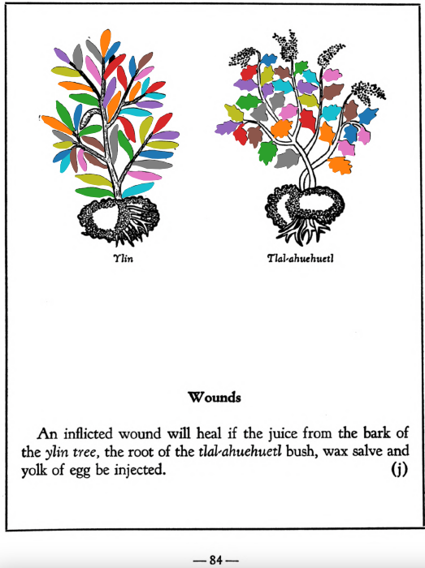

=== "English :flag_us:"
    **Wounds.** An inflicted wound will heal if the juice from the bark of the [ylin](Ylin.md) tree, the root of the [tlal-ahuehuetl](Tlal-ahuehuetl.md) bush, wax salve and yolk of egg be injected.  
    [https://archive.org/details/aztec-herbal-of-1552/page/84](https://archive.org/details/aztec-herbal-of-1552/page/84)  

=== "Español :flag_mx:"
    **Heridas.** Una herida causada sanará si se inyecta jugo de la corteza del árbol [ylin](Ylin.md), raíz del arbusto [tlal-ahuehuetl](Tlal-ahuehuetl.md), ungüento de cera y yema de huevo.  

  
Leaf traces by: Lachlann Simms, Acadia University, Canada  