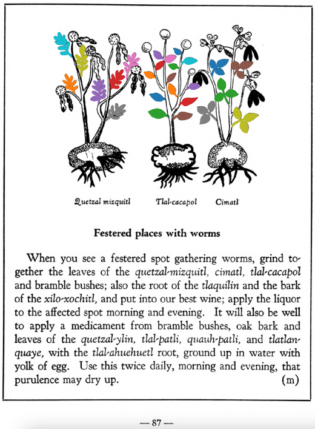

=== "English :flag_us:"
    **Festered places with worms.** When you see a festered spot gathering worms, grind together the leaves of the [quetzal-mizquitl](Quetzal-misquitl.md), [cimatl](Cimatl.md), [tlal-cacapol](Tlal-cacapol.md) and bramble bushes; also the root of the [tlaquilin](Tlaquilin.md) and the bark of the [xilo-xochitl](Xilo-xochitl.md), and put into our best wine; apply the liquor to the affected spot morning and evening. It will also be well to apply a medicament from bramble bushes, oak bark and leaves of the [quetzal-ylin](Quetzal-ylin.md), [tlal-patli](Tlal-patli.md), [quauh-patli](Quauh-patli.md), and [tlatlanquaye](Tlatlanquaye.md), with the [tlal-ahuehuetl](Tlal-ahuehuetl.md) root, ground up in water with yolk of egg. Use this twice daily, morning and evening, that purulence may dry up.  
    [https://archive.org/details/aztec-herbal-of-1552/page/87](https://archive.org/details/aztec-herbal-of-1552/page/87)  

=== "Español :flag_mx:"
    **Llagas con gusanos.** Cuando se ve una llaga supurante con gusanos, se muelen juntas las hojas del [quetzal-mizquitl](Quetzal-misquitl.md), [cimatl](Cimatl.md), [tlal-cacapol](Tlal-cacapol.md) y arbustos de zarzamora; también la raíz del [tlaquilin](Tlaquilin.md) y la corteza del [xilo-xochitl](Xilo-xochitl.md), y se ponen en nuestro mejor vino; se aplica este licor en la parte afectada por la mañana y por la noche. También conviene aplicar un medicamento de zarzamora, corteza de roble y hojas del [quetzal-ylin](Quetzal-ylin.md), [tlal-patli](Tlal-patli.md), [quauh-patli](Quauh-patli.md) y [tlatlanquaye](Tlatlanquaye.md), con la raíz del [tlal-ahuehuetl](Tlal-ahuehuetl.md), molido en agua con yema de huevo. Se usa esto dos veces al día, mañana y noche, para que la supuración se seque.  

  
Leaf traces by: Lachlann Simms, Acadia University, Canada  